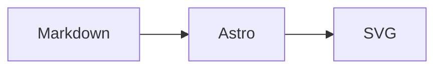

# Mermaid Diagram Rendering Implementation Plan

> **For agentic workers:** REQUIRED SUB-SKILL: Use superpowers:subagent-driven-development (recommended) or superpowers:executing-plans to implement this plan task-by-task. Steps use checkbox (`- [ ]`) syntax for tracking.

**Goal:** Render fenced `mermaid` blocks in Markdown posts as responsive client-side SVG diagrams, with strict Mermaid security and source-code fallback on errors.

**Architecture:** A focused Shiki transformer marks only Mermaid fences during Astro's Markdown build. A small post-layout browser module finds those markers, conditionally imports Mermaid, and replaces each valid source block only after successful rendering. Pure dependency injection keeps the renderer testable without a browser DOM, while the final task verifies the real Astro page in a browser.

**Tech Stack:** Astro 7, Shiki transformer hooks, Mermaid 11.16.1, Node.js assertions, CSS, in-app browser verification.

## Global Constraints

- Keep plain Markdown and the existing Obsidian authoring workflow; authors use fenced `mermaid` blocks.
- Keep GitHub Pages static deployment; do not add Chromium or browser automation to the production build.
- Bundle Mermaid locally and load its chunk only on posts containing a marked diagram.
- Initialize Mermaid with `startOnLoad: false`, `securityLevel: 'strict'`, a light theme, and the existing Pretendard font stack.
- Replace a source block only after that individual diagram renders successfully.
- Leave invalid Mermaid source visible and allow other diagrams to continue rendering.
- Keep non-Mermaid code highlighting and styling unchanged.
- Keep the site light-only and consistent with `DESIGN.md`.
- Start and manage local development with Astro background mode as required by `AGENTS.md`.

## File map

- Create `src/lib/mermaid-code-transformer.mjs`: marks Shiki output for fenced Mermaid source.
- Create `src/scripts/render-mermaid.mjs`: owns conditional loading, strict initialization, per-block rendering, and fallback behavior.
- Create `scripts/verify-mermaid-transformer.mjs`: exercises the transformer and its Astro configuration.
- Create `scripts/verify-mermaid-renderer.mjs`: exercises renderer behavior with small DOM-shaped test objects and checks layout/style wiring.
- Modify `astro.config.mjs`: registers the Shiki transformer.
- Modify `src/layouts/PostLayout.astro`: starts the browser renderer on post pages.
- Modify `src/styles/global.css`: styles successful diagrams and failed-source fallback.
- Modify `package.json` and `package-lock.json`: adds Mermaid and the focused verification command.
- Temporarily create `src/content/posts/mermaid-verification.md`: manual browser fixture, removed before handoff.

---

### Task 1: Mark fenced Mermaid blocks during Markdown rendering

**Files:**

- Create: `scripts/verify-mermaid-transformer.mjs`
- Create: `src/lib/mermaid-code-transformer.mjs`
- Modify: `astro.config.mjs`

**Interfaces:**

- Consumes: Shiki transformer context `this.options.lang` and the generated HAST `pre` node.
- Produces: `mermaidCodeTransformer`, which adds `data-mermaid=""` only when `lang === 'mermaid'`.

- [ ] **Step 1: Write the failing transformer verification**

Create `scripts/verify-mermaid-transformer.mjs`:

```js
import assert from 'node:assert/strict';
import { existsSync, readFileSync } from 'node:fs';

const transformerUrl = new URL('../src/lib/mermaid-code-transformer.mjs', import.meta.url);

assert.ok(existsSync(transformerUrl), 'Mermaid code transformer module must exist');

const { mermaidCodeTransformer } = await import(transformerUrl.href);

function transform(lang) {
  const node = { type: 'element', tagName: 'pre', properties: {}, children: [] };
  mermaidCodeTransformer.pre.call({ options: { lang } }, node);
  return node;
}

assert.equal(
  transform('mermaid').properties['data-mermaid'],
  '',
  'Mermaid fences must receive the data-mermaid marker',
);
assert.equal(
  transform('javascript').properties['data-mermaid'],
  undefined,
  'Non-Mermaid fences must remain unmarked',
);

const astroConfig = readFileSync(new URL('../astro.config.mjs', import.meta.url), 'utf8');
assert.match(astroConfig, /import \{ mermaidCodeTransformer \}/);
assert.match(astroConfig, /transformers:\s*\[mermaidCodeTransformer\]/);

console.log('Mermaid transformer verification passed.');
```

- [ ] **Step 2: Run the transformer verification and confirm RED**

Run: `node scripts/verify-mermaid-transformer.mjs`

Expected: exit 1 with `AssertionError: Mermaid code transformer module must exist`.

- [ ] **Step 3: Implement the minimal Shiki transformer**

Create `src/lib/mermaid-code-transformer.mjs`:

```js
export const mermaidCodeTransformer = {
  name: 'mermaid-code-block',
  pre(node) {
    if (this.options.lang === 'mermaid') {
      node.properties['data-mermaid'] = '';
    }
  },
};
```

Update `astro.config.mjs`:

```js
// @ts-check
import { defineConfig } from 'astro/config';

import tailwindcss from '@tailwindcss/vite';
import { mermaidCodeTransformer } from './src/lib/mermaid-code-transformer.mjs';

export default defineConfig({
  site: 'https://kitae0522.github.io',
  markdown: {
    shikiConfig: {
      transformers: [mermaidCodeTransformer],
    },
  },
  vite: {
    plugins: [tailwindcss()],
  },
});
```

- [ ] **Step 4: Verify GREEN and confirm the existing build still works**

Run: `node scripts/verify-mermaid-transformer.mjs && npm install && npm run build`

Expected: the transformer verification prints `Mermaid transformer verification passed.`, dependency installation succeeds, and Astro exits 0 after generating the existing routes.

- [ ] **Step 5: Commit the Markdown marker**

```bash
git add astro.config.mjs src/lib/mermaid-code-transformer.mjs scripts/verify-mermaid-transformer.mjs
git commit -m "feat: mark Mermaid Markdown blocks"
```

---

### Task 2: Render marked blocks with a conditional Mermaid client

**Files:**

- Create: `scripts/verify-mermaid-renderer.mjs`
- Create: `src/scripts/render-mermaid.mjs`
- Modify: `src/layouts/PostLayout.astro`
- Modify: `src/styles/global.css`
- Modify: `package.json`
- Modify: `package-lock.json`

**Interfaces:**

- Consumes: `.post-content pre[data-mermaid]` elements emitted by Task 1.
- Produces: `renderMermaidBlocks(options?) -> Promise<{ rendered: number, failed: number }>` and `.mermaid-diagram` containers containing SVG.
- `options.root` implements `querySelectorAll(selector)`.
- `options.loadMermaid` resolves to an object implementing `initialize(config)` and `render(id, source)`.
- `options.createContainer` returns an element with `className`, `innerHTML`, and `setAttribute(name, value)`.
- `options.reportError` receives a caught rendering error.

- [ ] **Step 1: Write the failing renderer verification**

Create `scripts/verify-mermaid-renderer.mjs`:

```js
import assert from 'node:assert/strict';
import { existsSync, readFileSync } from 'node:fs';

const rendererUrl = new URL('../src/scripts/render-mermaid.mjs', import.meta.url);
assert.ok(existsSync(rendererUrl), 'Mermaid browser renderer module must exist');

const { MERMAID_SELECTOR, renderMermaidBlocks } = await import(rendererUrl.href);

let emptyLoadCount = 0;
const emptyResult = await renderMermaidBlocks({
  root: { querySelectorAll: () => [] },
  loadMermaid: async () => {
    emptyLoadCount += 1;
    return {};
  },
});
assert.deepEqual(emptyResult, { rendered: 0, failed: 0 });
assert.equal(emptyLoadCount, 0, 'Mermaid must not load on posts without diagrams');
assert.equal(MERMAID_SELECTOR, '.post-content pre[data-mermaid]');

function createBlock(source) {
  return {
    textContent: source,
    dataset: {},
    attributes: {},
    replacement: undefined,
    setAttribute(name, value) {
      this.attributes[name] = value;
    },
    replaceWith(value) {
      this.replacement = value;
    },
  };
}

function createContainer() {
  return {
    className: '',
    innerHTML: '',
    attributes: {},
    setAttribute(name, value) {
      this.attributes[name] = value;
    },
  };
}

const validBlock = createBlock('graph TD\n  A --> B');
let initializedWith;
const validResult = await renderMermaidBlocks({
  root: { querySelectorAll: () => [validBlock] },
  loadMermaid: async () => ({
    initialize(config) {
      initializedWith = config;
    },
    async render(id, source) {
      assert.match(id, /^mermaid-diagram-\d+$/);
      assert.equal(source, 'graph TD\n  A --> B');
      return { svg: '<svg aria-label="diagram"></svg>' };
    },
  }),
  createContainer,
  reportError: assert.fail,
});
assert.deepEqual(validResult, { rendered: 1, failed: 0 });
assert.equal(initializedWith.startOnLoad, false);
assert.equal(initializedWith.securityLevel, 'strict');
assert.equal(initializedWith.theme, 'base');
assert.match(initializedWith.fontFamily, /Pretendard/);
assert.equal(validBlock.replacement.className, 'mermaid-diagram');
assert.match(validBlock.replacement.innerHTML, /<svg/);

const invalidBlock = createBlock('not a valid Mermaid diagram');
let reportedError;
const invalidResult = await renderMermaidBlocks({
  root: { querySelectorAll: () => [invalidBlock] },
  loadMermaid: async () => ({
    initialize() {},
    async render() {
      throw new Error('parse failed');
    },
  }),
  createContainer,
  reportError(error) {
    reportedError = error;
  },
});
assert.deepEqual(invalidResult, { rendered: 0, failed: 1 });
assert.equal(invalidBlock.replacement, undefined, 'Invalid source must remain in place');
assert.equal(invalidBlock.dataset.mermaidError, 'true');
assert.equal(invalidBlock.attributes.role, 'status');
assert.match(invalidBlock.attributes['aria-label'], /렌더링 실패/);
assert.equal(reportedError.message, 'parse failed');

const packageJson = JSON.parse(readFileSync(new URL('../package.json', import.meta.url), 'utf8'));
assert.match(packageJson.dependencies.mermaid, /^\^11\./);
assert.equal(
  packageJson.scripts['verify:mermaid'],
  'node scripts/verify-mermaid-transformer.mjs && node scripts/verify-mermaid-renderer.mjs',
);

const layout = readFileSync(new URL('../src/layouts/PostLayout.astro', import.meta.url), 'utf8');
assert.match(layout, /import \{ renderMermaidBlocks \}/);
assert.match(layout, /void renderMermaidBlocks\(\)/);

const css = readFileSync(new URL('../src/styles/global.css', import.meta.url), 'utf8');
assert.match(css, /\.post-content \.mermaid-diagram\s*\{/);
assert.match(css, /\.mermaid-diagram svg\s*\{/);
assert.match(css, /pre\[data-mermaid\]\[data-mermaid-error='true'\]/);

console.log('Mermaid renderer verification passed.');
```

- [ ] **Step 2: Run the renderer verification and confirm RED**

Run: `node scripts/verify-mermaid-renderer.mjs`

Expected: exit 1 with `AssertionError: Mermaid browser renderer module must exist`.

- [ ] **Step 3: Add the Mermaid dependency**

Run: `npm install mermaid@^11.16.1`

Expected: `package.json` and `package-lock.json` record Mermaid 11.x without changing the Node `>=22.12.0` requirement.

- [ ] **Step 4: Implement the testable browser renderer**

Create `src/scripts/render-mermaid.mjs`:

```js
export const MERMAID_SELECTOR = '.post-content pre[data-mermaid]';

export const MERMAID_CONFIG = {
  startOnLoad: false,
  securityLevel: 'strict',
  theme: 'base',
  fontFamily: '"Pretendard Variable", Pretendard, sans-serif',
};

let diagramSequence = 0;

export async function renderMermaidBlocks({
  root = globalThis.document,
  loadMermaid = async () => (await import('mermaid')).default,
  createContainer = () => document.createElement('figure'),
  reportError = (error) => console.error('Mermaid diagram rendering failed.', error),
} = {}) {
  const blocks = root ? [...root.querySelectorAll(MERMAID_SELECTOR)] : [];
  if (blocks.length === 0) return { rendered: 0, failed: 0 };

  const mermaid = await loadMermaid();
  mermaid.initialize(MERMAID_CONFIG);

  let rendered = 0;
  let failed = 0;

  for (const [index, block] of blocks.entries()) {
    const source = block.textContent?.trim() ?? '';
    const container = createContainer();
    container.className = 'mermaid-diagram';
    container.setAttribute('role', 'img');
    container.setAttribute('aria-label', `Mermaid 다이어그램 ${index + 1}`);

    try {
      const id = `mermaid-diagram-${++diagramSequence}`;
      const { svg, bindFunctions } = await mermaid.render(id, source);
      container.innerHTML = svg;
      block.replaceWith(container);
      bindFunctions?.(container);
      rendered += 1;
    } catch (error) {
      block.dataset.mermaidError = 'true';
      block.setAttribute('role', 'status');
      block.setAttribute(
        'aria-label',
        `Mermaid 다이어그램 ${index + 1} 렌더링 실패. 원본 코드.`,
      );
      reportError(error);
      failed += 1;
    }
  }

  return { rendered, failed };
}
```

- [ ] **Step 5: Wire the post layout without eager Mermaid loading**

Append inside `PostLayout.astro`, after the closing `</BaseLayout>`:

```astro
<script>
  import { renderMermaidBlocks } from '../scripts/render-mermaid.mjs';

  void renderMermaidBlocks();
</script>
```

The static import contains only the small renderer module. The `import('mermaid')` expression remains inside `loadMermaid`, so Vite emits Mermaid as a separate chunk fetched only after the selector finds a diagram.

- [ ] **Step 6: Add responsive diagram and fallback styling**

Add after the existing `.post-content pre code` rule in `src/styles/global.css`:

```css
.post-content .mermaid-diagram {
  overflow-x: auto;
  margin-block: 25px 0;
  padding-block: 8px;
  text-align: center;
}

.post-content .mermaid-diagram svg {
  display: block;
  width: auto;
  max-width: 100%;
  height: auto;
  margin-inline: auto;
}

.post-content pre[data-mermaid][data-mermaid-error='true'] {
  border-color: var(--accent);
}
```

- [ ] **Step 7: Add the focused verification command**

Add to `package.json` scripts:

```json
"verify:mermaid": "node scripts/verify-mermaid-transformer.mjs && node scripts/verify-mermaid-renderer.mjs"
```

- [ ] **Step 8: Verify GREEN and production compilation**

Run: `npm run verify:mermaid && npm run build`

Expected: both Mermaid verifiers print their pass messages, Astro generates all static routes, and the command exits 0 without warnings or errors.

- [ ] **Step 9: Commit the client renderer**

```bash
git add package.json package-lock.json scripts/verify-mermaid-renderer.mjs src/scripts/render-mermaid.mjs src/layouts/PostLayout.astro src/styles/global.css
git commit -m "feat: render Mermaid diagrams in posts"
```

---

### Task 3: Verify real Markdown, browser rendering, fallback, and regression safety

**Files:**

- Temporarily create, then remove: `src/content/posts/mermaid-verification.md`
- Verify: generated browser DOM and existing project checks

**Interfaces:**

- Consumes: the complete Markdown marker and client renderer from Tasks 1 and 2.
- Produces: evidence that valid Mermaid becomes SVG, invalid Mermaid stays as code, ordinary code remains unchanged, responsive layout works, and the final worktree has no temporary fixture.

- [ ] **Step 1: Create the temporary browser fixture**

Create `src/content/posts/mermaid-verification.md`:

````markdown
---
title: Mermaid 렌더링 검증
date: 2026-08-05
category: dev
tags:
  - mermaid
published: true
description: Mermaid 렌더링의 성공과 실패 동작을 확인하는 임시 글입니다
---

## 정상 다이어그램



## 일반 코드

```js
console.log('ordinary code block');
```

## 잘못된 다이어그램

```mermaid
this is not valid Mermaid syntax
```
````

- [ ] **Step 2: Start Astro in required background mode**

Run:

```bash
npm exec -- astro dev --background
npm exec -- astro dev status
```

Expected: status reports the background development server running and shows its local URL. If startup fails, run `npm exec -- astro dev logs` and resolve the exact error before continuing.

- [ ] **Step 3: Verify the desktop browser DOM**

Open `/posts/mermaid-verification` at the reported local URL and verify:

- Exactly one `.mermaid-diagram svg` exists for the valid flowchart.
- Exactly one `pre[data-mermaid][data-mermaid-error='true']` remains for invalid source.
- Exactly one ordinary `.astro-code` block without `data-mermaid` remains.
- The successful container has `role="img"` and a Korean `aria-label`.
- The invalid source remains readable and carries `role="status"`.
- Browser console contains only the expected `Mermaid diagram rendering failed.` entry for the deliberately invalid block.

- [ ] **Step 4: Verify mobile layout**

Set the browser viewport to 390 by 844 and confirm the diagram stays inside the article, preserves readable SVG proportions, and its container can scroll horizontally without widening the page.

- [ ] **Step 5: Stop the background server and remove the fixture**

Run: `npm exec -- astro dev stop`

Then remove only `src/content/posts/mermaid-verification.md`. Confirm `npm exec -- astro dev status` no longer reports a running server.

- [ ] **Step 6: Run the complete fresh verification set**

Run:

```bash
npm run verify:mermaid
node scripts/verify-minimal-editorial-design.mjs
node scripts/verify-obsidian-authoring.mjs
npm run build
git diff --check
git status --short --branch
```

Expected: all four verification/build commands exit 0, `git diff --check` prints nothing, the temporary fixture is absent, and status shows only intentional committed work.
