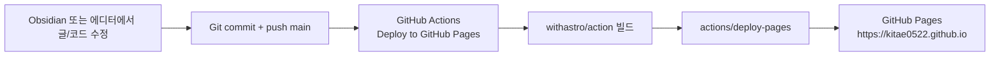

# Astro와 GitHub Pages로 블로그를 직접 만든 이유

안녕하세요. 송기태입니다.
오늘은 제가 블로그를 직접 만든 과정과 이유를 공유하려 합니다.
[이전 글](https://kitae0522.github.io/posts/2026-08-04-001/)에서 말씀드렸듯, 저는 기존 블로그 플랫폼 대신 직접 웹페이지를 구축했습니다.

## 블로그에서 중요했던 네 가지

블로그를 고를 때 아래 네 가지를 중요하게 봤습니다.

1. Markdown으로 글을 작성할 수 있을 것
2. 원하는 CSS를 적용할 수 있을 것
3. 글을 쉽게 Import/Export할 수 있을 것
4. 인프라 비용이 들지 않을 것

처음부터 직접 개발할 생각은 아니었습니다. 먼저 여러 플랫폼을 비교했습니다.

## 플랫폼 비교

| 플랫폼                      | Markdown             | 커스텀 CSS            | Import / Export       | 특징               |
| ------------------------ | -------------------- | ------------------ | --------------------- | ---------------- |
| 네이버 블로그                  | ❌ 자체 에디터 중심          | ❌                  | ⚠️ 범용 Markdown 입출력 없음 | 국내 사용자 접근성       |
| velog                    | ✅                    | ❌ 플랫폼 테마 내 사용      | ⚠️ Git 기반 원본 관리 아님    | 개발자 커뮤니티         |
| 티스토리                     | ⚠️ 에디터 기능 중심         | ✅ 스킨 HTML/CSS 편집   | ⚠️ 제한적                | 높은 디자인 자유도       |
| Medium                   | ⚠️ 리치 에디터 중심         | ❌                  | ⚠️ URL 기반 글 가져오기      | 글로벌 독자층          |
| 브런치                      | ❌ 리치 에디터 중심          | ❌                  | ❌ 제한적                 | 에디터 중심 플랫폼       |
| Hashnode                 | ✅                    | ⚠️ 기본 블로그 직접 수정 제한 | ✅ Markdown 가져오기·복사    | 개발자 대상 플랫폼       |
| **Astro + GitHub Pages** | **✅ 로컬 Markdown 파일** | **✅ 완전 자유**        | **✅ Git으로 직접 관리**     | **원본·디자인·배포 통제** |

> Hashnode도 좋은 선택지입니다. 다만 GitHub 백업, 대량 Markdown import, Headless 모드 같은 기능은 현재 Pro 플랜에 포함됩니다. 저는 글 원본과 디자인, 배포까지 모두 직접 관리하고 싶었습니다.

## 왜 직접 만들었나

글의 소유권을 온전히 제가 갖고 싶었습니다.

플랫폼 정책이나 기능 변화에 맞춰 글 작성 방식까지 바꾸고 싶지 않았습니다. 나중에 댓글, 검색, 통계, 뉴스레터처럼 필요한 기능을 추가할 때도 제약이 없어야 했습니다.

그래서 글의 원본을 Git 저장소에 Markdown 파일로 보관하고, 원하는 디자인으로 정적 웹사이트를 만들어 배포하는 방식을 선택했습니다.

## 처음 고려한 기술 스택

저는 Codex 20배 플랜을 사용하고 있습니다. GPT-5.6 Sol Xhigh에게 아래 요구사항을 전달하고 기술 스택을 추천받았습니다.

- Markdown 기반 글 작성
- 커스텀 CSS 적용
- 무료 배포
- 나중에 기능 확장 가능
- Obsidian 중심의 작성 흐름

처음 추천받은 구조는 **Next.js + S3** 조합이었습니다.

로그인, 회원가입, 대시보드 같은 기능을 추가하기에는 좋은 구조입니다. 하지만 지금 필요한 것은 글을 작성하고 배포하는 블로그였습니다. 제 목적에는 조금 과하다고 판단했습니다.

## Obsidian + Astro를 선택한 이유

저는 Obsidian에서 글을 쓰는 방식이 가장 편합니다. 커뮤니티 플러그인을 설치하거나, 직접 플러그인을 만들어서, 제가 원하는 대로 에디터를 커스텀할 수 있습니다. (단축키, 스니펫, 글 작성 후 배포 자동화 등등)

Markdown 파일을 작성하고, HTML로 변환한 뒤, 원하는 CSS를 적용해 배포하면 충분했습니다. 처음에는 Go로 아래 역할을 하는 CLI 도구를 직접 만들 생각도 했습니다.

> Tokenizer → Parser → Renderer → HTML 생성

그리고 GitHub Actions에서 CLI를 실행해 정적 HTML을 생성하는 흐름을 구상했습니다.

하지만 Astro를 사용하면 Markdown 처리와 정적 사이트 생성 기능을 직접 구현할 필요가 없습니다. 제가 원하는 작성·배포 흐름을 더 단순하게 만들 수 있었습니다.

## 배포 흐름

글을 작성한 뒤 `main` 브랜치에 push하면 GitHub Actions가 Astro 프로젝트를 빌드하고 GitHub Pages에 배포합니다.

GitHub Pages는 공개 저장소 기준으로 무료로 사용할 수 있습니다. 단, 자체 도메인을 연결한다면 도메인 등록·갱신 비용은 별도입니다.

## 마치며

이 블로그의 전체 소스는 [GitHub](https://github.com/kitae0522/kitae0522.github.io)에 공개되어 있습니다.

아래와 같은 분이라면 한 번 참고해보셔도 좋을 것 같습니다.

- Obsidian에서 편하게 글을 쓰고 싶은 분
- 플랫폼 제약 없이 글을 관리하고 싶은 분
- 글과 데이터의 소유권을 직접 갖고 싶은 분
- 원하는 CSS와 기능을 자유롭게 적용하고 싶은 분
- 복잡한 인프라는 부담스러운 분

Astro와 GitHub Pages 조합은 “직접 만들되, 굳이 모든 것을 직접 구현하지는 않는” 선택지였습니다.

Markdown·Import 기능과 Hashnode Pro 범위는 [Hashnode 문서](https://docs.hashnode.com/blogs/blog-dashboard/import), [Pro 안내](https://hashnode.com/changelog/2026-06-11-introducing-hashnode-pro)를 기준으로 정리했습니다. GitHub Pages 무료 범위는 [GitHub 공식 문서](https://docs.github.com/en/get-started/learning-about-github/githubs-plans) 기준입니다.
