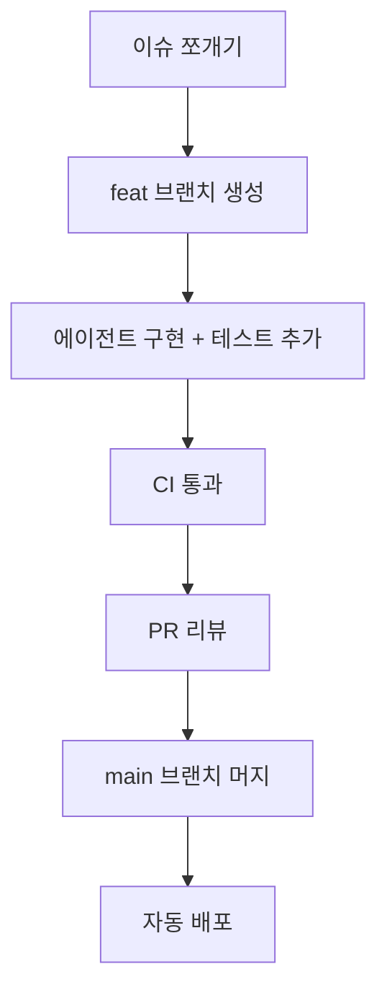

안녕하세요, 송기태입니다.  
오늘은 제가 요즘 주로 쓰는 `git` 브랜치 전략을 공유하려 합니다.

## 코드 작성보다 통합이 중요해진 시대

여러분은 AI 코딩 에이전트를 쓰고 계신가요? 쓰고 있다면 어떤 도구를 쓰시나요? 저는 Claude Code를 몇 달간 쓰다가, 지금은 ChatGPT Codex에 정착했습니다. 두 에이전트를 써보며 얻은 인상은 이렇습니다.

- **Claude Code**: Planning을 세심하게 잘하는 느낌
- **Codex**: Implementing을 깔끔하게 밀어붙이는 느낌

언젠가 둘 다 구독한 뒤에는 이런 파이프라인을 구성해 보고 싶습니다.
> Planning (Claude Code) → Implementing (Codex) → Reviewing (Codex)

코딩 에이전트가 빠르게 좋아지면서, 병목은 “코드를 얼마나 빨리 만드는가”가 아니라 “얼마나 안전하게 통합하고 검증하느냐” 쪽으로 옮겨갔다고 생각합니다. 올해엔 저도 직접 코딩하는 비중은 거의 없고, 설계, 이슈, 리뷰, 머지 판단에 시간을 더 쓰고 있습니다.

그래서 새 프로젝트를 시작할 때 브랜치 전략도 예전과 다르게 가져가고 있습니다.

## 짧게 따고, 작게 합치고, main은 항상 배포 가능하게

사실 이 전략을 찾아보고 시작한 것은 아닙니다. 제 스스로 AI 환경에서는 이렇게 운영하는 편이 더 낫겠다고 먼저 생각해서 진행을 했었고, 나중에 찾아보니 이 전략이 **Trunk-Based Development**에 가깝더군요.

이 전략을 채택한 이유는 단순합니다. AI는 코드를 순식간에 대량 생성합니다. 그 결과 브랜치가 길어지고 PR이 쉽게 비대해집니다. 물론 머지는 항상 신중하게 해야하지만, PR이 쉽게 비대해지면 코드리뷰를 할 때 피로감이 느껴지기도 하고, 작업의도가 해당 PR에 녹아들어갔는지 확인하기 어려워지며, 머지를 주저하게 됩니다. 초기 제품에는 이런 병목이 제품 개발에 치명적이라고 생각했습니다. 이런 과정에서 전통적인 Git Flow처럼 브랜치를 오래 들고 가는 방식은, 자주 배포해야 하는 초기 제품에는 잘 맞지 않죠.

### 기본 규칙

**Trunk-Based** 전략의 규칙은 단순합니다.

- `main`은 항상 배포 가능한 상태로 유지합니다.
- feature 브랜치는 수 시간~며칠 안에 `main`으로 머지합니다.
- release / hotfix 같은 장기 브랜치는 쓰지 않습니다.

실무에서는 이렇게 적용합니다.

1. 작업 단위를 작게 쪼갭니다. (하루 안에 머지 가능한 크기)
2. `main`에 자주 머지합니다.
3. CI가 깨지면 최우선으로 고칩니다.
4. 배포는 `main`에서 자동으로 나갑니다.
5. 미완성 기능이 필요하면 feature flag로 숨긴 채 통합합니다.

한 줄로 말하면, **브랜치를 많이 나눠 안정성을 확보하는 전략이 아니라, 작은 변경 + 자동화 테스트 + 빠른 통합으로 안정성을 확보하는 전략**입니다.

### 하루 작업 루프 예시

에이전트에게 작업을 맡길 때는 한 PR에 기능 추가, 대규모 리팩터, 설정 변경을 섞지 않도록 명시합니다. PR이 커지는 순간 이 전략의 장점이 사라지기 때문입니다.

## Git Flow와 비교

| 항목         | Git Flow                        | Trunk-Based    |
| ---------- | ------------------------------- | -------------- |
| 중심 브랜치     | main + develop + release/hotfix | main 하나        |
| 브랜치 수      | 많음 (5종 전후)                      | 적음 (1~3)       |
| feature 수명 | 길 수 있음 (주~월)                    | 매우 짧음 (시간~수일)  |
| 머지 주기      | 느림, 큰 PR                        | 빠름, 작은 PR      |
| 배포         | 릴리즈 브랜치 기반, 주기적                 | main 기반, 연속 배포 |
| CI/CD 궁합   | 상대적으로 약함                        | 매우 강함          |
| 다중 버전 유지   | 유리                              | 불리             |

Git Flow는 버전 단위 릴리즈, QA 단계 분리, 여러 메이저 버전 동시 지원에는 여전히 강합니다. 다만 웹 서비스처럼 배포 주기가 짧고 변경이 잦은 환경에서는, 장기 브랜치가 merge 비용과 리뷰 부담을 키우기 쉽습니다.

## 언제 쓰면 좋을까

배포를 자주하거나, 엣지 케이스까지 커버 가능한 테스트로 main 브랜치 품질을 지킬 수 있는 자신감이 있는 팀에는 Trunk-Based가 잘 맞습니다. 중요한 점은, TBD가 “아무 때나 main에 넣으면 되는 전략”은 아니라는 것입니다.   **테스트와 팀 규율이 약하면 main이 쉽게 오염되고, 사고 빈도가 오히려 올라갈 수 있습니다.**

## AI 시대에 개발자가 챙길 것

AI 덕분에 코드 초안을 만드는 비용은 크게 낮아졌습니다. 그래서 개발자의 핵심 업무도 바뀌고 있다고 생각합니다.

- 에이전트에게 엣지 케이스를 커버하는 테스트를 먼저 작성하게 할 것
- PR 리뷰에서 동작 여부뿐 아니라 실패 모드, 롤백 가능성, 관측 가능성을 볼 것
- 큰 변경을 작은 머지 단위로 쪼개 통합 리스크를 낮출 것

코드를 “얼마나 많이 만들었는가”보다, **얼마나 자주 안전하게 합치고 배포할 수 있는가**가 더 중요해진 시점입니다.