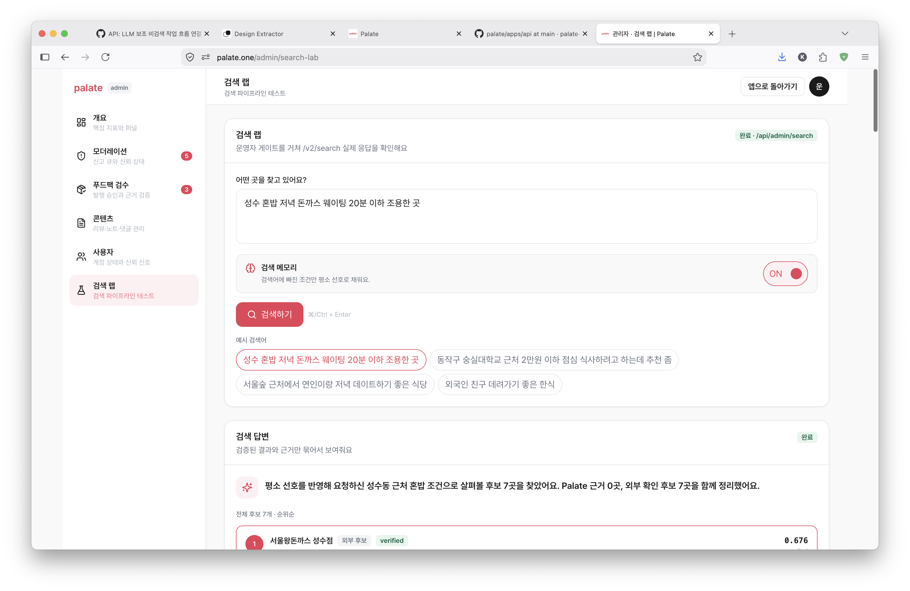
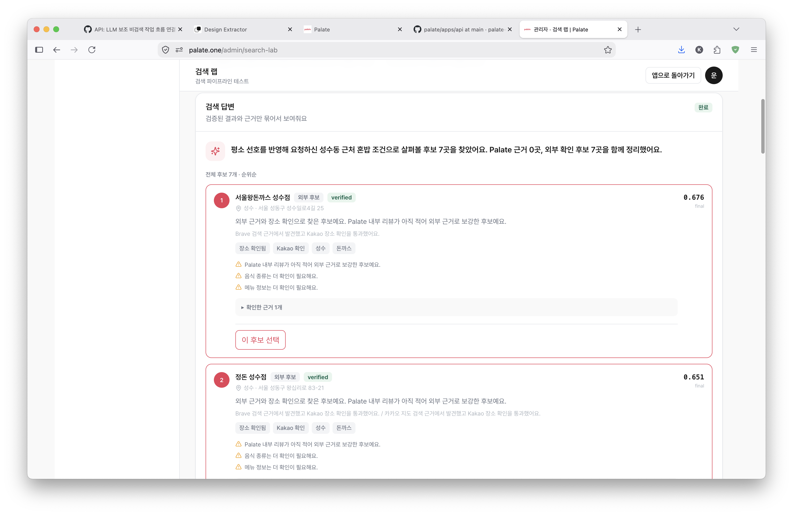
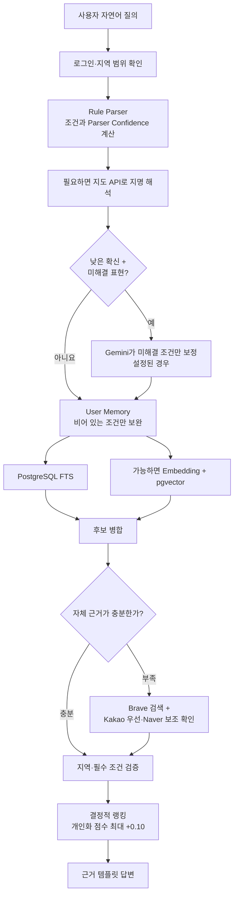
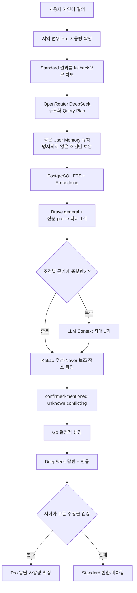

안녕하세요. 송기태입니다.
요즘 Palate의 검색엔진을 거의 처음부터 다시 검토하고 있습니다. 시작은 단순했습니다.

> 지금 검색엔진이 너무 구리다.

조금 과격하게 말했지만, 실제로 느끼던 문제였습니다. 검색 결과가 아예 나오지 않는 것은 아닙니다. 장소와 메뉴를 찾고, 지역을 확인하고, 점수를 계산해 결과도 보여줍니다. 그런데 제가 만들고 싶은 검색 경험과는 거리가 있었습니다.

제가 만들고 싶은 것은 식당 이름을 여러 개 나열하는 검색창이 아닙니다. **사용자가 오늘 어디에 갈지 결정할 수 있게 도와주는 맛집 검색 도메인의 Perplexity**에 가깝습니다.

## 현재 검색엔진은 어떻게 동작하나

먼저 현재 코드를 다시 따라가 봤습니다. 지금의 Palate Standard는 아래처럼 동작합니다.

여기서 `ParserConfidence`는 LLM이 스스로 말하는 자신감이 아닙니다. 위치와 메뉴를 얼마나 명확하게 찾았는지, 미해결 표현과 충돌이 남았는지를 코드로 계산한 값입니다. 조건 충돌이 없고 이 값이 기본 기준인 `0.72`보다 낮으며 미해결 표현이 있을 때만, 기능이 켜진 환경에서 Gemini가 그 표현을 위치·음식·상황 같은 조건으로 제안합니다. 이 제안도 사용자 원문에 실제로 있는 표현이어야 하며, Rule Parser나 지도 API가 이미 확인한 조건을 덮어쓸 수 없습니다.

User Memory도 단순한 취향 가산점이 아닙니다. 사용자가 메모리를 켰을 때만, 검색어에 없는 예산·음식 종류·메뉴·식사 맥락을 과거 선호로 보완합니다. 사용자가 직접 말한 조건이 항상 우선이고, 기억한 지역을 쓰려면 다시 확인받습니다. 지역락을 넓히는 데에는 사용할 수 없습니다. 필수 조건 검증을 통과한 후보에만 최대 `0.10`의 개인화 점수가 더해집니다.

그 뒤 PostgreSQL FTS와, 사용할 수 있다면 Embedding 검색 결과를 합칩니다. 자체 근거가 부족할 때만 Brave와 지도 API로 후보를 보강합니다. 마지막 조건 검사와 순위 계산은 Go 코드가 담당하고, 답변도 아직은 근거가 정해진 템플릿입니다.

이 구조의 장점은 분명합니다. 빠르고 비용을 예측하기 쉬우며, 특정 결과가 왜 위에 올라왔는지 코드로 추적할 수 있습니다. 존재하지 않는 식당을 만들거나 인증 지역 밖의 식당을 추천하는 문제도 통제하기 쉽습니다.

하지만 자연어 검색에서는 한계가 금방 보였습니다.

> Q. 압구정로데오에서 혼자 밥 먹기 좋고, 주차 가능하고, 2만 원 안쪽인 히레 돈카츠 맛집 추천해줘.

이 질의에는 위치, 혼밥, 주차, 예산과 메뉴가 한꺼번에 들어 있습니다. Rule Parser는 명확한 위치나 메뉴에는 강하지만, `혼자 밥 먹기 좋다`처럼 문맥에 따라 달라지는 조건과 여러 조건의 우선순위를 다루기 어렵습니다. `돈카츠·돈까스`를 언제 같은 개념으로 볼지, `히레·안심`을 어떻게 묶을지도 계속 사전에 추가해야 합니다. 모든 표현을 규칙으로 관리하는 데에는 한계가 있었습니다.

더 큰 문제는 데이터의 폭과 최신성이었습니다. Palate의 리뷰 데이터만으로 확실하게 답할 수 있는 지역과 식당은 아직 제한적입니다. 검색 결과를 만들 수는 있지만, 사용자가 원하는 조건에 정말 맞는지 충분한 근거를 보여주지 못할 때가 있었습니다.

## 데이터를 더 많이 가져오면 된다고 생각했다

처음 생각한 구조는 다음과 같았습니다.

> Palate DB 검색(FTS + Embedding) + Naver·Kakao Map Wrapper + 외부 검색 증강

방향 자체는 지금도 유효합니다. 문제는 `어떤 데이터를`, `어떤 방법으로`, `어디까지 사실로 취급할 것인가`였습니다.

네이버지도와 카카오지도에는 메뉴, 영업시간, 주차, 리뷰처럼 탐나는 정보가 많습니다. 지도 상세 페이지에서 이 정보까지 가져오는 방법도 생각했습니다. 하지만 접근 제한을 우회한 수집에 핵심 검색엔진을 의존하면 법적 위험뿐 아니라 운영 안정성도 나빠집니다. 차단 방식이 바뀔 때마다 제품 기반이 흔들리게 됩니다.

여기서 이런 의문이 생겼습니다.

> Perplexity도 실시간으로 웹 검색하는데, 우리는 왜 못하지?

문제는 **실시간 웹 검색 자체가 아니었습니다.** 허용된 API로 현재 웹의 근거를 찾고 출처를 표시하는 것과, 보호된 지도 페이지를 긁어 데이터베이스로 복제하는 것은 다른 문제였습니다. Palate가 가져가야 할 핵심은 외부 원문을 쌓는 일이 아니라, 검색할 때 근거를 찾고 그 범위 안에서 답하는 경험이었습니다.

그래서 Brave Search API를 실시간 외부 검색 계층으로 사용하기로 했습니다. Pro에서는 Brave가 반환한 제목, 짧은 문맥과 URL을 현재 검색의 근거로만 사용하고 출처를 표시합니다. 네이버와 카카오는 공식 Local API를 통해 장소 이름, 주소, 카테고리, 좌표와 동일 장소 여부를 확인하는 역할을 맡깁니다.

지도에서 `지역 + 메뉴`로 검색했을 때 식당이 나온다고 해서 그 식당에 해당 메뉴가 있다고 확정하지도 않습니다. 이것은 후보를 발견한 신호일 뿐입니다. 실제 메뉴는 Palate 리뷰·메뉴 기록, 식당의 공식 정보, 허가된 데이터 또는 현재 웹 검색 결과에 메뉴가 명시돼 있을 때만 근거로 사용합니다.

데이터의 양만큼 중요한 것이 **그 데이터를 어디까지 믿을 수 있는지 표시하는 일**이라는 결론에 도달했습니다.

## 설문을 다시 보니 문제는 검색 결과 수가 아니었다

검색 구조를 논의하면서 이전에 진행했던 식당 검색 경험 설문도 다시 확인했습니다. 유효 응답은 156건이었습니다.

- 75%가 검색한 뒤 다른 서비스에서 정보를 다시 확인했습니다.
- 72.4%가 실제 방문 후 검색 정보와 다른 경험을 한 적이 있었습니다.
- 56.4%가 여러 조건을 함께 만족하는 검색을 원했습니다.

메뉴와 가격을 중요하게 본 응답은 46.2%, 최신 정보 확인을 어려워한 응답은 42.3%였습니다.

사용자는 식당을 더 많이 보여달라는 것이 아니었습니다. 내가 말한 조건에 왜 맞는지, 정보가 지금도 유효한지, 확실하지 않은 부분은 무엇인지 알고 싶어 했습니다. 원하는 식당이 없을 때에는 비슷한 대안도 필요했습니다.

따라서 새 검색엔진의 품질은 답변이 길거나 그럴듯한지가 아니라 다음 세 가지로 판단해야 합니다.

- 요청 조건을 얼마나 근거와 함께 확인했는가
- 오래되거나 충돌하는 정보와 인용을 정확히 표시했는가
- 사용자가 상위 세 개 안에서 실제로 결정할 수 있는가

## Standard, Pro 로 나누다

- **Palate Standard**: 현재의 결정적 검색 모델
- **Palate Pro**: LLM과 더 넓은 외부 근거를 사용하는, 현재 설계 중인 검색 모델

무료 사용자와 Plus 구독자가 쓰는 Pro의 품질은 같습니다. 차이는 사용할 수 있는 횟수와 권한입니다. 지역락도 검색 모델이 아니라 구독 정책에 속합니다.

사용 횟수도 감이 아니라 설문을 기준으로 정했습니다. 응답자의 69.2%는 실제 식당 선택이 월 5회 이하였고, 88.5%는 월 10회 이하였습니다. 무료 사용자에게 Pro 30회를 주면 대부분에게 사실상 무제한이 됩니다. 초기 실험값은 다음처럼 낮췄습니다.

| 사용자  | Standard | Pro   | 검색 지역 |
| ---- | -------- | ----- | ----- |
| free | 무제한      | 월 3회  | 인증 지역 |
| Plus | 무제한      | 월 30회 | 전국    |

3회와 30회는 영구적인 정답이 아닙니다. 출시 뒤 실제 사용량과 전환율을 보기 위한 시작점입니다.

## 설계 중인 Pro는 무엇이 다른가

현재 API에는 아직 검색 모델 선택이 없습니다. 아래는 구현 완료된 구조가 아니라, 지금 설계하고 있는 Pro의 목표 구조입니다.

Standard 결과에 LLM으로 긴 설명만 붙이면 사용자는 차이를 느끼지 못합니다. Pro는 질의를 구조화하는 단계부터 근거를 찾는 범위까지 달라야 합니다. OpenRouter의 DeepSeek 모델은 처음에 복합 조건을 구조화하고, 마지막에 검증된 후보의 차이와 대안을 인용과 함께 정리합니다.

이때도 LLM의 `confidence`를 사실 판정에 사용하지 않습니다. 각 조건이 사용자 원문에 있는지, 어떤 출처가 뒷받침하는지 서버가 다시 확인합니다. LLM은 식당을 추가하거나 순서를 바꿀 수 없습니다. 거리, 지역락, 메뉴·예산 적합도, 최신성과 출처 간 일치도는 계속 코드가 계산합니다.

웹 검색 profile도 많이 켠다고 좋아지지 않았습니다. 여러 profile을 동시에 호출하자 중복과 특정 사이트 편중, 비용과 지연이 함께 늘었습니다. 그래서 Pro는 `general`과 질의에 가장 맞는 전문 profile 하나까지만 사용하기로 했습니다. 조건별 근거가 부족할 때만 LLM Context를 한 번 더 호출합니다.

외부 정보는 `confirmed`, `mentioned`, `unknown`, `conflicting`으로 구분합니다. 웹에서 한 번 언급된 주차 정보를 확인된 사실처럼 말하지 않고, 서로 다른 영업시간이 발견되면 충돌을 숨기지 않습니다. 사용자가 주차를 필수 조건으로 말했는데 확인할 수 없다면 추천에서 제외합니다.

## 가장 싼 것은 의외로 LLM이었다

2026년 8월 22일 기준으로 계산한 Pro 검색 한 번의 예상 provider 원가는 약 9.6원에서 42.7원, 기준 시나리오는 약 25.1원이었습니다.

재미있는 점은 OpenRouter를 통한 DeepSeek의 질의 분석과 답변 구성이 약 1원으로, 비용의 대부분이 아니었다는 것입니다. 기준 시나리오에서는 Brave 검색 두 번이 약 14원으로 더 컸습니다.

결국 비용 최적화의 핵심은 더 싼 LLM을 끝없이 찾는 것이 아니라, 외부 검색과 지도 확인을 언제 호출할지 결정하고 캐시와 hard cap을 두는 일이었습니다.

Plus 사용자가 월 30회를 모두 사용하면 기준 provider 원가는 약 753원입니다. 실제 사용량을 보기 전까지는 이 정도가 안전한 시작점이라고 판단했습니다.

## Pro는 출시 전에 Standard를 눈에 띄게 이겨야 한다

LLM을 붙였다는 이유만으로 Pro라고 부를 수는 없습니다. 답변이 조금 자연스러워졌는데 검색 결과가 똑같다면 사용자는 차이를 느끼지 못합니다.

그래서 같은 질의와 같은 지역에서 Standard와 Pro를 가리고 비교할 평가 corpus를 만들기로 했습니다. 지역 축약, 구어체, 메뉴와 가격을 함께 묻는 질의, 혼밥·데이트·회식, 주차·예약·웨이팅, 최신 정보 충돌과 결과가 없어야 하는 경우까지 포함합니다.

- 상위 세 개 안에서 실제 결정을 내릴 수 있는 비율이 Standard보다 15%p 이상 높을 것
- 요청 조건에 근거를 제시하는 비율이 Standard보다 20%p 이상 높을 것
- 인용 정확도는 100%, 필수 조건 위반은 0건일 것

이 기준을 통과하지 못하면 모델을 조용히 바꾸며 운에 맡기지 않습니다. Pro 기능을 열지 않고 retrieval, prompt와 평가 corpus를 다시 고칩니다. 실행 중 Pro 단계가 실패해도 미리 확보한 Standard 결과로 돌아가며, 사용자의 Pro 횟수는 차감하지 않습니다.

## 내가 만들고 싶은 것은 식당 목록이 아니다

검색엔진을 다시 설계하면서 제품의 방향도 더 명확해졌습니다.

기존 검색 서비스에서 `압구정로데오 혼밥 닭요리 주차`를 입력하면 관련 있어 보이는 식당 목록을 받을 수 있습니다. 하지만 사용자가 진짜 알고 싶은 것은 목록이 아닙니다.

- 내 조건을 실제로 만족하는 곳은 어디인가
- 왜 이 식당이 첫 번째인가
- 메뉴와 가격은 지금도 맞는가
- 주차 정보는 확인됐는가, 단순히 언급만 됐는가
- 첫 번째 식당이 어렵다면 다음 대안은 무엇인가

Palate Pro는 이 질문에 답하는 검색 모델이 되어야 합니다. 자체 리뷰 데이터의 깊이, 실시간 웹 검색의 폭, 지도 API의 장소 확인 능력과 LLM의 자연어 이해를 결합하되, 최종 판단은 검증 가능한 규칙과 근거 위에 남겨두고 싶습니다.

사용자가 추천 결과를 받은 뒤 네이버지도, 카카오맵, 블로그와 SNS를 다시 열어 같은 정보를 반복해서 확인하지 않아도 되는 경험. 검색 결과를 믿으라고 강요하는 대신, 무엇을 확인했고 무엇을 아직 모르는지 솔직하게 보여주는 경험. 그것이 제가 생각하는 **맛집 검색 도메인의 Perplexity**입니다.

아직 검색엔진이 좋아졌다고 말할 단계는 아닙니다. 지금까지 한 일은 현재 Standard를 다시 이해하고, Pro가 달라져야 할 지점과 비용, 품질 기준을 설계한 것입니다. 다음 단계는 같은 질의를 두 모델에 넣고 실제 사용자가 차이를 느끼는지 검증하는 일입니다.

그래도 이전과 달라진 점은 하나 있습니다. 이제는 단순히 “검색엔진이 구리다”가 아니라, **어떤 검색이 좋아져야 하는지 측정할 수 있게 됐습니다.**
