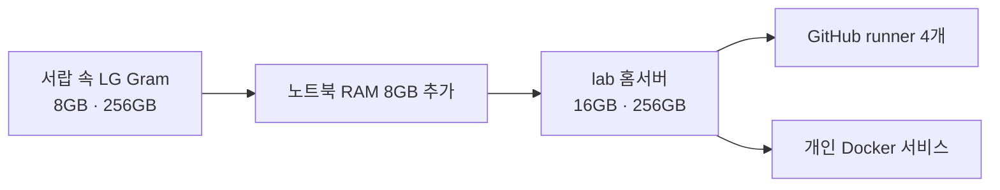
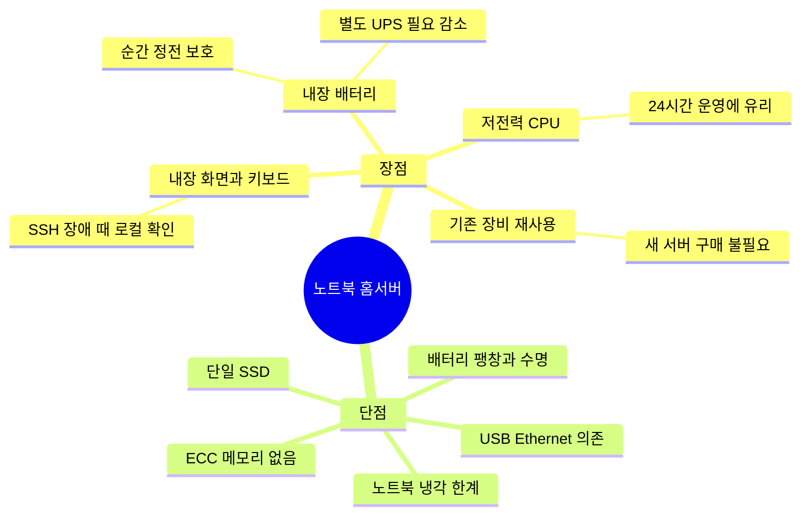
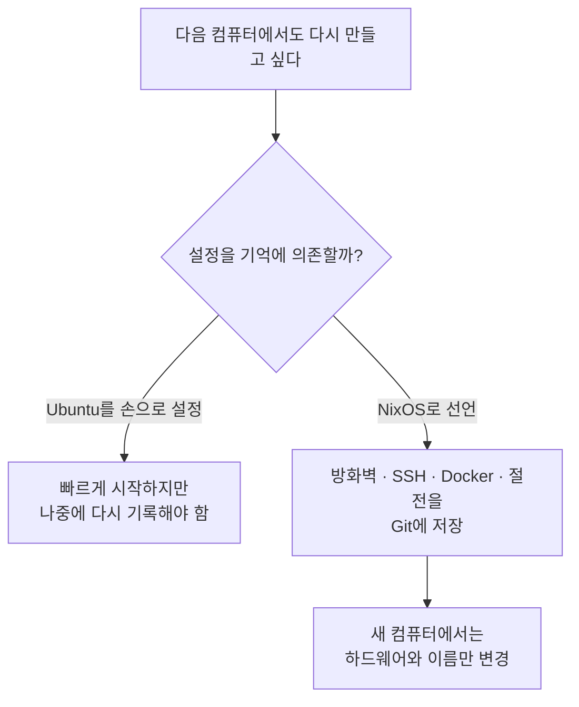
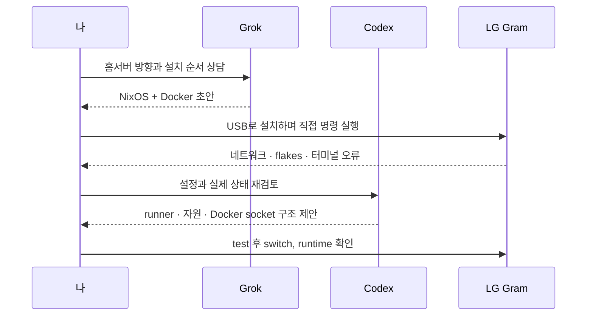

<nav class="series-toc" aria-label="홈서버 운영기 목차">
  
홈서버 운영기

  <ol>
    <li><a href="/posts/2026-08-31-001/" aria-current="page">01 Actions 3,000분이 모자랐다 <em>현재 글</em></a></li>
    <li><a href="/posts/2026-08-31-002/">02 집 밖에서 접속하기</a></li>
    <li><a href="/posts/2026-08-31-003/">03 러너 4개 돌리기</a></li>
    <li><a href="/posts/2026-08-31-004/">04 Docker 앱 올리기</a></li>
    <li><a href="/posts/2026-08-31-005/">05 이제 무엇을 올릴까</a></li>
  </ol>
</nav>

안녕하세요. 송기태입니다. 오늘은 제가 홈서버를 만들게 된 계기와 어떻게 운영하고 있는지, 거기서 발생한 문제는 뭐였는지, 앞으로 어떻게 할 것인지에 대해서 적어보도록 하겠습니다. 이번에는 시리즈 형태로 제작할 예정입니다.

## Actions 시간이 또 부족했다

홈서버를 만들게 된 이유는 거창하지 않았습니다.

> GitHub Actions 시간이 또 부족했다.

Private Repository에서 쓸 수 있던 Actions 시간은 한 달에 2,000분이었습니다. 시간으로 바꾸면 33시간 20분입니다. Blacksmith로 옮긴 뒤에는 3,000분, 정확히 50시간으로 늘었습니다. 1,000분, 비율로는 50%가 늘어난 셈입니다.

그런데도 부족했습니다. 프로젝트가 하나일 때는 괜찮았지만, 여러 private repository에서 테스트와 Docker image build를 돌리니 50시간도 생각보다 빨리 사라졌습니다.

2026년 8월 현재 [GitHub Actions billing 문서](https://docs.github.com/en/billing/concepts/product-billing/github-actions)에도 Free 플랜은 월 2,000분, Pro 플랜은 3,000분으로 안내되어 있습니다. self-hosted runner에서 사용한 시간은 GitHub-hosted runner의 무료 시간에서 차감되지 않습니다. 물론 전기, 장비와 관리 시간은 제가 부담합니다.

## 서랍 속 LG Gram이 눈에 들어왔다

새 서버를 사기 전에 집을 둘러봤습니다. 제가 고등학생 때 우분투를 올려서 사용했던 LG 그램 14ZD980이 있었습니다.

| 항목      |          처음 상태 |           현재 상태 |
| ------- | -------------: | --------------: |
| CPU     | Intel i5-8250U |    동일, 4코어 8스레드 |
| 메모리     |            8GB |            16GB |
| SSD     |          256GB |              동일 |
| 메모리 증가량 |              - | 8GB 추가, 100% 증가 |

서랍에서 쉬고 있던 8GB 노트북에 노트북 DDR4 8GB RAM을 하나 더 장착했습니다. 16GB면 작은 CI job 여러 개와 몇 개의 개인 서비스를 함께 돌려볼 수 있다고 판단했습니다. (+ 추가로 랜 포트가 없어서 USB-Ethernet을 연결했습니다.)

## 노트북을 서버로 써보니

서버라면 데스크톱이나 미니 PC부터 떠올리기 쉽습니다. 그런데 집에서 직접 운영해보니 오래된 노트북도 장점이 분명했습니다.

첫째, **배터리가 작은 UPS 역할을 합니다.** 순간적으로 전원이 끊겨도 서버 본체는 바로 꺼지지 않습니다. 별도 UPS를 사지 않아도 파일시스템이 갑자기 끊길 위험을 어느 정도 줄일 수 있습니다.

다만 공유기와 모뎀에는 배터리가 없습니다. 정전 중에도 외부 접속까지 유지하려면 네트워크 장비에는 별도 전원 대책이 필요합니다. 노트북 배터리는 서버 본체를 위한 UPS에 가깝습니다.

둘째, i5-8250U는 노트북용 저전력 프로세서입니다. 또한 작성 시점의 유휴 CPU 온도는 약 38℃였습니다. 고성능 데스크톱을 계속 켜두는 것보다는 제 용도에 잘 맞았습니다.

셋째, **화면과 키보드가 이미 붙어 있습니다.** SSH가 끊기거나 네트워크 설정을 잘못 바꿔도 모니터와 키보드를 따로 연결할 필요가 없습니다. 덮개를 열고 바로 상태를 확인하면 됩니다.

물론 공짜는 아닙니다. 장시간 충전 상태로 두는 배터리는 팽창과 열화를 확인해야 합니다. 노트북 냉각 구조는 지속적인 고부하에 최적화된 서버보다 약합니다. ECC 메모리도 없고 SSD도 한 개뿐이라 데이터 중복성이 없습니다. USB Ethernet이 빠지거나 오작동할 가능성도 있습니다.

## Ubuntu 대신 NixOS를 고른 이유

처음에는 Ubuntu를 설치하고 Docker를 올리면 된다고 생각했습니다. 하지만 나중에 더 좋은 스펙의 서버 컴퓨터를 맞추게 된다면, 그 컴퓨터에서도 똑같은 설정을 가진 홈서버를 만들고 싶었습니다. 그때 방화벽, SSH, Docker, 절전 설정을 다시 검색하고 손으로 입력하고 싶지는 않았습니다.

그래서 서버 설정을 코드로 저장하고 쉽게 재현할 수 있는 NixOS를 선택했습니다.

이 선택이 설치를 쉽게 만들어준 것은 아닙니다. 오히려 처음에는 Nix 문법과 flakes, systemd 설정까지 새로 배워야 했습니다. 대신 완성된 뒤에는 현재 서버가 왜 이렇게 동작하는지 설정 파일로 다시 읽을 수 있게 됐습니다.

## Grok으로 시작해 Codex와 마무리했다

혼자였다면 여기까지 오는 데 훨씬 오래 걸렸을 겁니다. Nix 문법을 배우고, 직접 테스트해보고....
이런 점들을 AI Agent의 힘을 받아 구현하여, 더더욱 쉽고 빠르게 완성할 수 있었습니다.

Grok과 처음 대화하면서 NixOS 위에 Docker를 두는 큰 방향과 설치 순서를 잡았습니다. 실제 설치 중에는 USB Ethernet, private repository clone, flakes와 비밀번호 hash에서 계속 막혔습니다.

그 뒤 Codex와 Nix 설정을 다시 검토했습니다. Docker socket을 일반 CI job에 자동으로 주지 않는 구조, 16GB 안에서 runner 네 개를 나누는 방식, 적용 전후 검증 절차를 함께 정리했습니다.

AI가 노트북을 열어 RAM을 꽂아주거나 USB를 다시 연결해준 것은 아닙니다. 제 대신 최종 판단을 해준 것도 아닙니다. 하지만 낯선 오류를 해석하고, 설정을 코드로 옮기고, 제가 놓친 위험을 찾는 속도는 확실히 빨라졌습니다.

결국 이 서버는 남는 노트북 한 대와 RAM 8GB, 그리고 꽤 긴 AI 대화로 만들어졌습니다.

다음 글에서는 가장 많이 궁금해할 만한 내용을 다룹니다. 공유기 포트를 하나도 열지 않고, 집 밖에서 이 노트북과 Docker 서비스에 어떻게 접속했는지 정리하겠습니다.
