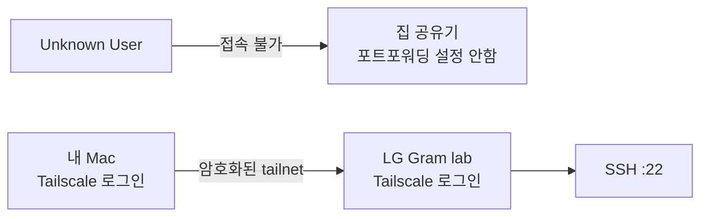
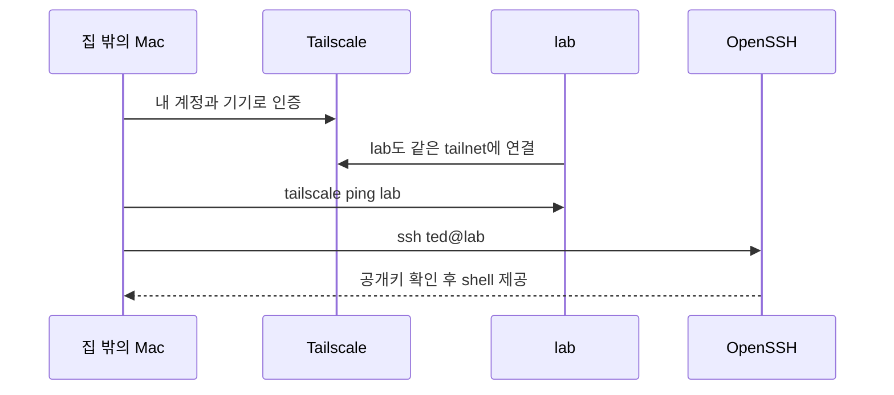
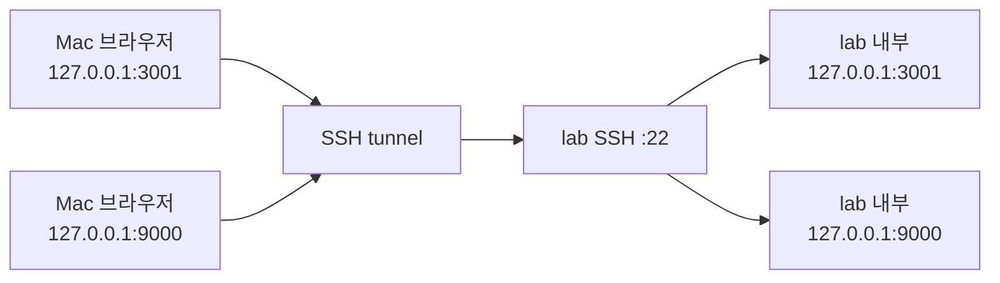
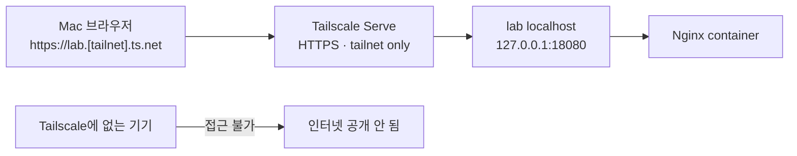
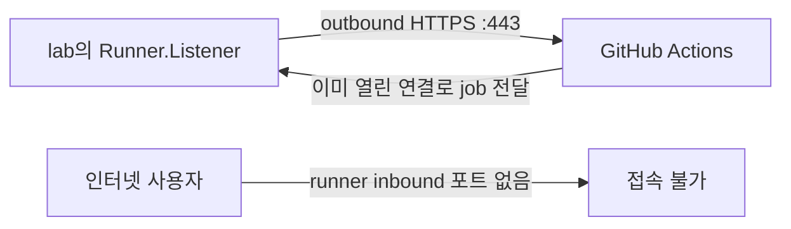
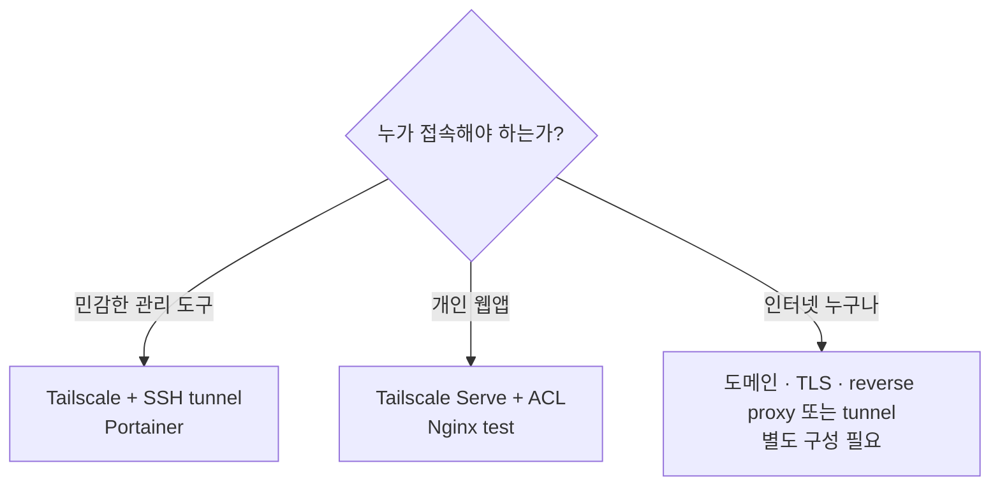
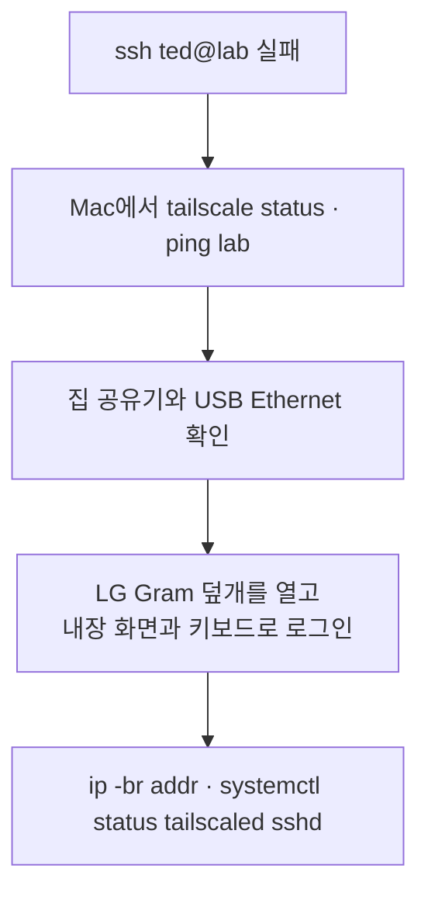

안녕하세요. 송기태입니다.

[이전 글](https://kitae0522.github.io/posts/2026-08-31-001/)에서 Actions 시간 부족 때문에 오래된 LG Gram을 홈서버로 바꾼 이야기를 했습니다.

홈서버 이야기를 들으면 가장 먼저 이런 질문이 생깁니다.

> 집 밖에서는 어떻게 접속하지? 공유기 포트를 열어둔 건가?

결론부터 말하면 공유기 포트포워딩은 하지 않았고, 집의 공인 IP도 외부에 공개하지 않았습니다. Mac과 홈서버를 Tailscale로 연결하고, shell은 SSH로, 개인 웹앱은 Tailscale Serve로 접근합니다.

## 외부 접속과 인터넷 공개는 다르다

제가 원한 것은 누구나 들어올 수 있는 공개 웹서버가 아니었습니다. **내 기기에서만 접속할 수 있는 개인 서버**였습니다.



Tailscale은 제 기기들 사이에 별도의 사설망인 tailnet을 만들어줍니다. 노트북이 집 공유기 뒤에 있어도 Mac과 `lab`이 같은 사설망에 있는 것처럼 연결됩니다. 대부분의 환경에서는 공유기의 inbound 포트를 직접 열 필요가 없습니다.

이 구성에서 역할은 다음처럼 나뉩니다.

| 도구 | 하는 일 |
| --- | --- |
| Tailscale | 집 밖의 Mac과 `lab` 사이에 사설 네트워크를 만듭니다 |
| SSH | 그 네트워크 안에서 서버 셸에 안전하게 접속합니다 |
| SSH tunnel | 서버의 로컬 웹 서비스를 Mac 브라우저까지 전달합니다 |
| Tailscale Serve | 로컬 웹 서비스를 tailnet 전용 HTTPS 주소로 제공합니다 |
| NixOS firewall | 일반 네트워크에서 불필요한 포트를 막습니다 |

## 실제로는 이렇게 접속한다

서버에서 Tailscale을 한 번 활성화했습니다.

```bash
sudo tailscale up
tailscale status
```

Mac에도 Tailscale을 설치하고 같은 tailnet에 로그인했습니다. MagicDNS가 켜져 있으면 서버의 Tailscale IP를 외울 필요 없이 hostname으로 접속할 수 있습니다.

```bash
tailscale ping lab
ssh ted@lab
```

MagicDNS를 사용하지 않는다면 `lab` 대신 Tailscale이 할당한 IP를 사용하면 됩니다.



SSH는 비밀번호 로그인을 받지 않습니다. root 로그인도 막고, Mac의 SSH 공개키를 가진 `ted` 사용자만 접속할 수 있게 했습니다. `fail2ban`도 켜두었습니다.

공식적으로 일반 네트워크 방화벽에 허용한 TCP 포트는 22번뿐입니다. 그렇다고 인터넷 전체에서 22번 포트가 열려 있다는 뜻은 아닙니다. 공유기에서 포트포워딩하지 않았기 때문에 외부 인터넷에서 집 안의 `lab:22`로 바로 들어올 경로가 없습니다.

## 서비스는 먼저 localhost에만 연다

Uptime Kuma는 3001번, Portainer는 9000번 포트를 사용합니다. 하지만 두 서비스 모두 서버의 `127.0.0.1`에만 연결했습니다.

```text
Uptime Kuma  127.0.0.1:3001
Portainer    127.0.0.1:9000
```

`127.0.0.1`은 서버 자기 자신만 접근할 수 있는 주소입니다. 따라서 집 안 Wi-Fi나 Tailscale에 연결됐더라도 `lab:3001`을 브라우저에 입력해서는 열리지 않습니다.

처음에는 웹 화면이 필요할 때마다 Mac에서 SSH tunnel을 만들었습니다.

```bash
ssh -N \
  -L 3001:127.0.0.1:3001 \
  -L 9000:127.0.0.1:9000 \
  ted@lab
```

그 상태에서 Mac 브라우저로 접속합니다.

- `http://127.0.0.1:3001`: Uptime Kuma
- `http://127.0.0.1:9000`: Portainer



명령에 사용한 `-N`은 원격 shell을 열지 않고 포트 전달만 하겠다는 뜻입니다. 이 SSH 프로세스를 종료하면 tunnel도 함께 닫힙니다.

Portainer처럼 Docker host의 강한 권한과 연결된 관리 도구에는 지금도 이 방식을 사용합니다. 하지만 일반 개인 웹앱까지 볼 때마다 터미널 하나를 계속 열어두는 것은 불편했습니다.

## 터미널 없이 접속하려고 Tailscale Serve를 붙였다

Tailscale Serve는 서버의 `127.0.0.1` 서비스를 tailnet 전용 HTTPS 주소로 전달합니다. Tailscale에 로그인한 허용 기기만 접근할 수 있고, 인터넷 전체에 공개하는 Funnel과는 다릅니다.

먼저 테스트용 Nginx container를 실행했습니다.

```text
container  external-access-smoke
image      nginx:alpine
bind       127.0.0.1:18080
limit      CPU 0.25 · memory 128MB · PID 128
```

서버 내부의 `http://127.0.0.1:18080`에서는 Nginx 화면이 정상적으로 열렸지만, Mac에서는 직접 접근할 수 없는 상태였습니다.

Serve를 처음 사용할 때는 tailnet 관리 화면에서 HTTPS와 Serve를 한 번 활성화해야 했습니다. 이어서 `ted`가 매번 `sudo`를 입력하지 않고 Serve를 관리할 수 있도록 operator도 한 번 지정했습니다.

```bash
sudo tailscale set --operator=ted
```

그 뒤 Nginx를 background Serve로 연결했습니다.

```bash
tailscale serve --bg --yes http://127.0.0.1:18080
tailscale serve status
```

실제 tailnet 이름은 블로그에서 가렸습니다. 출력은 다음과 같은 형태입니다.

```text
Available within your tailnet:

https://lab.<tailnet>.ts.net/
|-- proxy http://127.0.0.1:18080
```

Mac에서 이 HTTPS 주소를 요청해 다음을 확인했습니다.

| 확인 항목 | 결과 |
| --- | --- |
| Tailscale DNS | `lab` 주소 정상 해석 |
| Tailscale 경로 | direct 연결, 같은 LAN에서 2ms |
| TLS | TLS 1.3, 인증서 검증 성공 |
| HTTP | HTTP/2 `200 OK` |
| backend | Nginx 1.31.4 |



[`--bg`로 설정한 Serve](https://tailscale.com/docs/reference/tailscale-cli/serve)는 터미널을 닫아도 계속 실행되고 Tailscale 재시작이나 서버 재부팅 뒤에도 복구됩니다. 비활성화할 때는 다음 명령을 사용합니다.

```bash
tailscale serve --https=443 off
```

현재 같은 LAN에서 HTTPS 경로까지 검증했습니다. 실제 집 밖 경로는 Mac을 휴대폰 hotspot에 연결한 뒤 같은 주소로 한 번 더 확인하면 됩니다.

이번 설정은 동작을 이해하기 위해 CLI로 적용했습니다. 서버를 새로 설치해도 그대로 재현하려면 다음 단계에서 Nix의 systemd service로 이 Serve 선언을 옮겨야 합니다.

## GitHub Actions는 어떻게 서버를 찾아올까

GitHub Actions runner를 위해서도 inbound 포트를 열지 않았습니다. 여기서는 방향이 반대입니다. `lab`에서 실행 중인 runner가 GitHub에 outbound HTTPS 연결을 만들고 job을 기다립니다.



즉, GitHub가 집 공유기를 뚫고 제 노트북으로 새 연결을 만드는 것이 아닙니다. 서버가 먼저 GitHub와 연결해두고 일을 받아옵니다. [GitHub의 self-hosted runner 문서](https://docs.github.com/en/actions/reference/runners/self-hosted-runners)도 runner host가 GitHub로 outbound HTTPS 연결을 할 수 있어야 한다고 설명합니다.

## 이 구조에서 아직 공개 웹서비스는 없다

현재 구성은 개인용 외부 접속입니다. 앞으로 토이 프로젝트를 인터넷 사용자에게 공개하려면 별도의 설계가 필요합니다.



인터넷 공개가 필요한 앱은 인증, TLS, rate limit과 업데이트까지 같이 고민해야 합니다. 아직 `lab`에는 그 공개 경로를 만들지 않았습니다. Serve는 tailnet 내부용이고 Funnel은 사용하지 않습니다. “홈서버에 외부에서 접속할 수 있다”와 “홈서버가 인터넷에 공개되어 있다”를 의도적으로 분리했습니다.

## 네트워크가 망가지면 어떻게 하나

설치할 때 USB Ethernet이 보이지 않아 한참 헤맸습니다. `/sys/class/net`에는 Wi-Fi만 있었는데 어댑터를 뺐다가 다시 꽂자 `enp0s20f0u1`이 생겼고 바로 통신됐습니다.

지금도 SSH가 안 되면 다음 순서로 확인합니다.



이때 노트북의 내장 화면과 키보드가 특히 유용합니다. 별도 모니터나 키보드를 창고에서 꺼낼 필요 없이 바로 콘솔을 볼 수 있습니다. 원격 접속이 문제인데 원격 접속으로만 고치려는 상황을 피할 수 있습니다.

Tailscale은 연결 경로를 제공할 뿐, 접근 정책을 대신 결정해주지는 않습니다. 앞으로 기기가 늘어나면 [Tailscale access policy](https://tailscale.com/kb/1429/secure)도 더 좁게 설정할 계획입니다.

다음 글에서는 이 네트워크 안에서 GitHub Actions runner 네 개를 실제로 돌려본 결과와, self-hosted runner를 사용하면서 얻은 장단점을 숫자로 정리하겠습니다.
