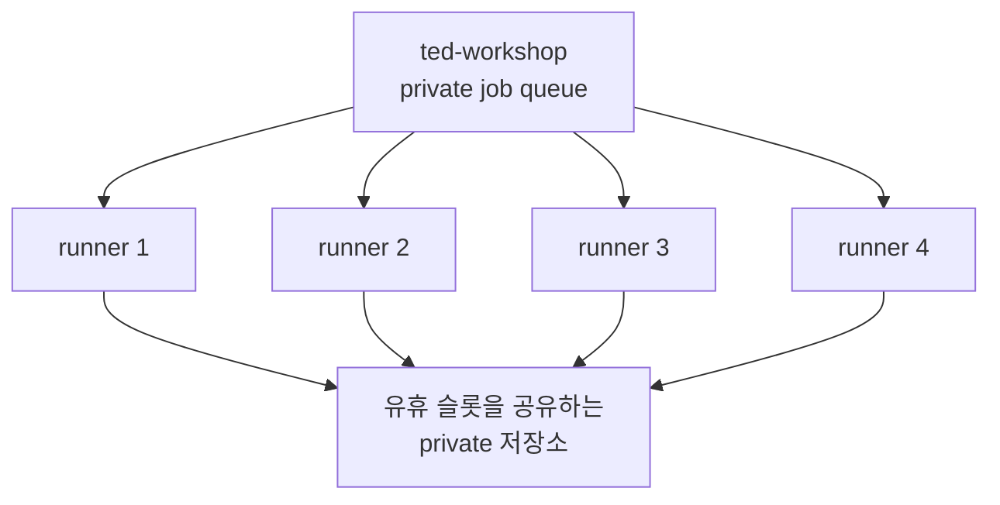
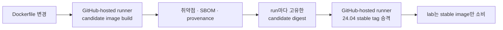
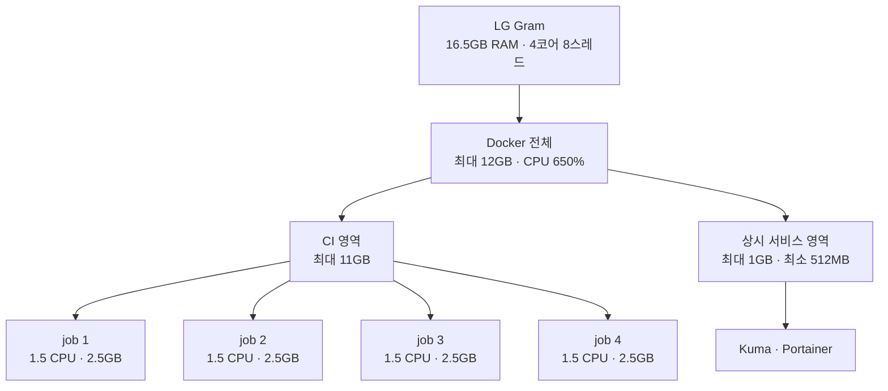
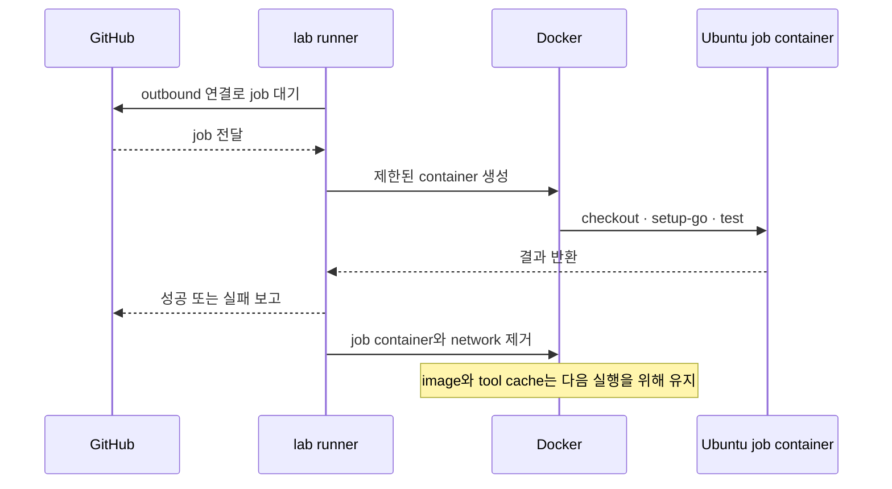
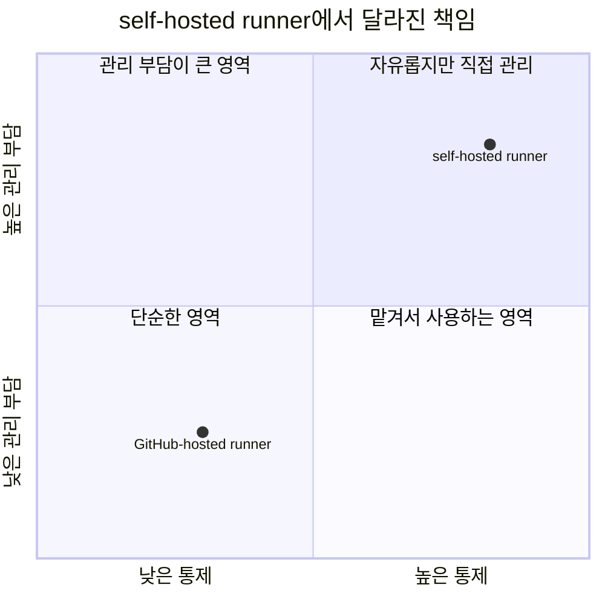

<nav class="series-toc" aria-label="홈서버 운영기 목차">
  
홈서버 운영기

  <ol>
    <li><a href="/posts/2026-08-31-001/">01 Actions 3,000분이 모자랐다</a></li>
    <li><a href="/posts/2026-08-31-002/">02 집 밖에서 접속하기</a></li>
    <li><a href="/posts/2026-08-31-003/" aria-current="page">03 러너 4개 돌리기 <em>현재 글</em></a></li>
    <li><a href="/posts/2026-08-31-004/">04 Docker 앱 올리기</a></li>
    <li><a href="/posts/2026-08-31-005/">05 이제 무엇을 올릴까</a></li>
  </ol>
</nav>

안녕하세요. 송기태입니다.

GitHub Actions 2,000분이 부족해 Blacksmith로 옮겼고, 3,000분으로 늘어난 뒤에도 부족했습니다. 그래서 [외부에서 안전하게 접속할 수 있게 만든 LG Gram](https://kitae0522.github.io/posts/2026-08-31-002/)에 self-hosted runner를 올렸습니다.

현재 `lab`에는 runner가 네 개 있습니다. 처음에는 저장소마다 슬롯을 고정했습니다. bot에 세 개, CI image에 한 개였습니다. 누가 어느 runner를 쓰는지 분명했지만, 한 저장소가 바쁠 때 다른 runner는 그대로 놀았습니다. 공개 저장소의 코드를 집 노트북에서 돌리는 것도 부담이었습니다.

그래서 네 슬롯을 `ted-workshop` organization 공유 풀로 옮겼습니다. org 안의 private repository가 유휴 슬롯을 나눠 씁니다. public 저장소와 fork PR은 이 풀을 쓰지 않습니다.

생성되는 서비스 이름은 `lab-ted-workshop-1`부터 `-4`입니다. 새 private 저장소를 온보딩할 때는 runner 인스턴스를 추가하지 않고, `ted-workshop`으로 옮긴 뒤 같은 여섯 라벨을 붙입니다. `ci-images`와 기숙사 식단 bot은 GitHub-hosted runner만 사용합니다.

## 공용 CI 이미지 저장소 분리 전략

self-hosted runner만 등록한다고 job에 필요한 `git`, `curl`, compiler와 Docker CLI가 자동으로 생기지는 않습니다. 프로젝트마다 Dockerfile을 복사하면 설치 도구와 보안 설정이 조금씩 달라지고, 업데이트도 여러 repository에서 반복해야 합니다.

그래서 [kitae0522/ci-images](https://github.com/kitae0522/ci-images)를 별도 public repository로 만들었습니다. 앞으로 다른 프로젝트도 같은 기반을 재사용하기 위한 작은 CI image 공장입니다.

현재 두 image를 관리합니다.

| image | 포함하는 것 | 사용처 |
| --- | --- | --- |
| `ci-ubuntu-base` | Ubuntu 24.04, Git, curl, build-essential, Python 등 | 일반 test와 lint |
| `ci-ubuntu-docker` | base + Docker CLI, Buildx, Compose | 신뢰된 Docker build job |

Docker image 안에 Go, Node.js, Rust와 Java를 모두 넣지는 않았습니다. 프로젝트마다 필요한 version이 다르기 때문에 `setup-go` 같은 action으로 선택합니다. credential, private source, SSH key, Nix secret과 Docker daemon도 image에 넣지 않습니다.

`ci-ubuntu-docker`에도 daemon은 없습니다. Docker build가 필요한 job만 `lab`의 전용 socket을 명시적으로 받아 host daemon을 사용합니다. 일반 base job은 기본 `/var/run/docker.sock`이 실제 socket이면 오히려 실패합니다.

새 CI image를 self-hosted runner만으로 만들면 순환이 생길 수 있습니다. 잘못된 새 image 때문에 runner job이 시작되지 않는데, 그 image를 고칠 build도 같은 runner image가 필요한 상황입니다. 그래서 후보 제작과 최종 승격은 GitHub-hosted runner에 맡겼습니다. `ci-images` 저장소 자체는 lab runner를 쓰지 않습니다.

`lab`은 이미 승격된 stable image만 사용합니다. 잘못된 새 image 때문에 홈서버 job이 막혀도, image를 고치는 build는 GitHub-hosted runner에서 계속할 수 있습니다.

`HIGH` 취약점이 발견되면 자동 release는 중단되고 기존 stable digest를 그대로 유지합니다. 정말 예외가 필요하면 owner, 이유와 만료일을 적은 수동 실행만 허용합니다. image를 공통으로 쓰는 만큼 한 번의 실수가 여러 repository로 퍼지지 않게 하려는 구조입니다.

결국 `ci-images`를 분리한 이유는 거대한 만능 image를 만들기 위해서가 아닙니다. **여러 프로젝트가 공유할 최소 Ubuntu 환경과 Docker 권한 경계를 한곳에서 검증하기 위해서**입니다.

## 3개 Job 병렬 실행 및 성능 검증

세 runner가 동시에 준비되는지 확인하기 위해 같은 smoke job을 세 개 실행했습니다. 측정은 저장소별 배정이던 초기에 했고, 세 job은 모두 오후 4시 55분 43초에 시작했습니다. 공유 풀로 바꾼 뒤에도 한 host에서 작은 job 여러 개를 같이 받는 한계는 같습니다.

| job | 시작 | 완료 | 소요 시간 |
| --- | --- | --- | ---: |
| smoke 1 | 16:55:43 | 16:56:10 | 27초 |
| smoke 2 | 16:55:43 | 16:56:11 | 28초 |
| smoke 3 | 16:55:43 | 16:56:12 | 29초 |

세 job을 순서대로 실행했다면 단순 합계로 약 84초가 필요합니다. 실제로는 가장 늦은 job 기준 29초에 끝났습니다. 테스트 자체가 1초 내외인 작은 프로젝트라서 절대 시간보다 **세 개가 정말 동시에 움직였다는 사실**이 중요했습니다.

```mermaid
gantt
  title 3개 smoke job의 실제 병렬 실행
  dateFormat HH:mm:ss
  axisFormat %M:%S
  section lab runners
  smoke 1 :s1, 16:55:43, 27s
  smoke 2 :s2, 16:55:43, 28s
  smoke 3 :s3, 16:55:43, 29s
```

warm cache 상태에서 `actions/setup-go`는 0~1초 만에 끝났습니다. 각 runner가 자기 tool cache를 유지하기 때문에 매 job마다 Go를 처음부터 내려받지 않아도 됩니다.

Blacksmith와 정교한 동일 조건 성능 비교를 한 것은 아닙니다. 이 결과만으로 self-hosted가 항상 더 빠르다고 말할 수는 없습니다. 제가 확인한 것은 작은 Go job 세 개를 집의 노트북이 30초 안쪽으로 병렬 처리했다는 사실입니다.

## 16GB 환경의 컨테이너 리소스 할당 최적화

runner 네 개를 만들었다고 네 job에 메모리를 무제한으로 주면 안 됩니다. CI가 폭주해 SSH까지 먹통이 되면 원격으로 복구할 수 없기 때문입니다.

각 job에는 최대 1.5 CPU, 메모리 2,560MB, PID 768개를 줬습니다. 네 job이 동시에 메모리 상한까지 사용하면 약 10GB입니다.

Docker 전체가 사용할 수 있는 메모리는 12GB로 제한했습니다. 나머지는 NixOS, SSH, systemd와 파일 cache가 숨을 쉴 공간입니다. CPU는 Docker 전체에 최대 6.5코어 상당을 허용했습니다. 물리 코어는 네 개지만 Hyper-Threading을 포함해 논리 CPU는 여덟 개입니다.

유휴 상태를 직접 측정한 결과는 다음과 같습니다.

| 항목 | 실측값 |
| --- | ---: |
| 전체 메모리 | 약 16.5GB |
| 사용 중인 메모리 | 약 2.76GB |
| 사용 가능한 메모리 | 약 13.76GB |
| runner 4개 RSS 합계 | 약 530MiB |
| Uptime Kuma | 약 107MiB |
| Portainer | 약 17MiB |
| CPU 온도 | 약 38℃ |

측정값은 아무 CI job도 돌지 않는 시점의 snapshot입니다. 실제 빌드 중에는 이미지와 컴파일러에 따라 CPU와 메모리가 훨씬 높아집니다.

## 작업이 끝나면 컨테이너도 사라지는 라이프사이클

대기 중인 runner는 NixOS의 systemd 서비스입니다. job을 받으면 Ubuntu container를 만들고, 테스트가 끝나면 container를 내립니다.

따라서 평소 `docker ps`에 CI container가 보이지 않는 것은 정상입니다. runner가 멈춘 것이 아니라 job을 기다리고 있는 상태입니다.

모든 job은 `container:`를 선언해야 합니다. 선언하지 않으면 NixOS host에서 직접 실행되지 않고 실패하도록 했습니다. 프로젝트가 Go여도 `actions/checkout`과 `actions/setup-go` 같은 JavaScript action을 실행해야 해서 runner에는 standalone Node 24도 준비했습니다.

## 직접 운영해서 좋았던 점

### 월간 사용 시간을 계산하지 않아도 된다

[GitHub Actions billing 문서](https://docs.github.com/en/billing/concepts/product-billing/github-actions)에 따르면 self-hosted runner의 실행 시간은 무료입니다. 이제 2,000분이나 3,000분이 언제 끝나는지 계산하는 대신 제 노트북의 실제 용량을 봅니다.

### 작은 작업 네 개를 함께 돌릴 수 있다

큰 서버 한 대처럼 빠르지는 않지만, lint와 작은 Go test가 줄을 서는 시간을 줄일 수 있습니다. 용량이 부족하면 job이 queue에 남기 때문에 한계도 눈에 보입니다.

### CI 환경을 직접 정할 수 있다

Ubuntu base image, Docker 도구, Go cache와 보안 검사를 직접 정할 수 있습니다. 같은 image를 반복해서 사용하므로 환경 차이도 줄어듭니다.

### 남는 노트북을 다시 쓰게 됐다

새 서버를 구매하지 않고 RAM 8GB만 추가했습니다. 배터리, 화면과 키보드까지 서버 운영에 도움이 됐습니다.

## 대신 내가 책임져야 할 것

### 전기와 관리 시간은 공짜가 아니다

GitHub 사용료 대신 전기, 인터넷, RAM과 제 관리 시간이 들어갑니다. 정확한 소비 전력과 월 전기요금은 아직 측정하지 않았습니다. 추후 스마트 플러그로 기록할 계획입니다.

### 고장 나면 직접 고쳐야 한다

GitHub-hosted runner는 고장 난 VM을 GitHub가 교체하지만, 이 노트북의 SSD나 USB Ethernet이 고장 나면 제가 직접 복구해야 합니다. 집 인터넷이 끊기거나 공유기가 재부팅돼도 job은 멈춥니다.

### 아무 코드나 실행할 수 없다

Docker socket에 접근하는 job은 사실상 host를 제어할 수 있습니다. 공개 repository의 fork PR이나 모르는 사람이 작성한 코드를 이 runner에서 실행하면 안 됩니다. 현재는 `ted-workshop` organization의 private repository 전용입니다.

### 네 슬롯을 넘기지는 않는다

runner는 여전히 네 개입니다. 다만 저장소마다 고정하지 않고 `ted-workshop`의 private repository가 유휴 슬롯을 공유합니다. 동시에 다섯 번째 job이 오면 GitHub이 빈 슬롯을 기다립니다. 큰 빌드와 공개 fork PR은 여전히 GitHub-hosted runner나 별도 장비가 더 적합합니다.

### 캐시도 관리 대상이다

빠른 실행을 위해 runner별 tool cache를 유지합니다. 그래서 같은 슬롯에서 다음에 실행되는 job을 신뢰해야 합니다. bun과 Puppeteer처럼 설치가 무거운 도구는 org 풀이 공유하는 호스트 캐시도 씁니다. 속도를 얻는 대신 운영 경계가 하나 더 생겼습니다.

저에게 self-hosted runner의 가장 큰 장점은 무조건 빠르거나 공짜라는 것이 아니었습니다. **월간 시간 제한을 하드웨어 용량이라는 이해 가능한 한계로 바꾼 것**이었습니다.

다음 글에서는 CI가 만든 Docker image를 실제 홈서버 서비스로 올리는 흐름을 다룹니다. job container가 끝나면 사라지는 것과, 계속 실행될 서비스 container를 배포하는 것은 별개의 과정입니다.
