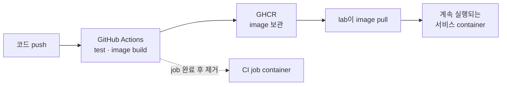
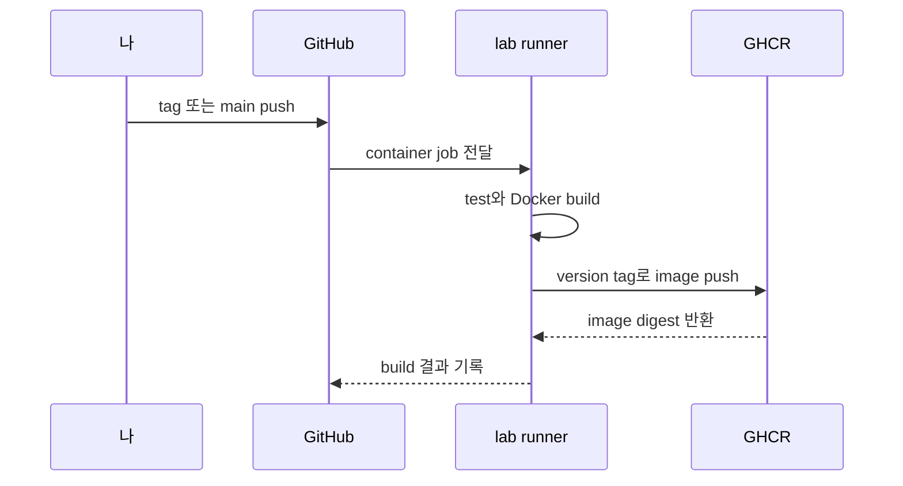
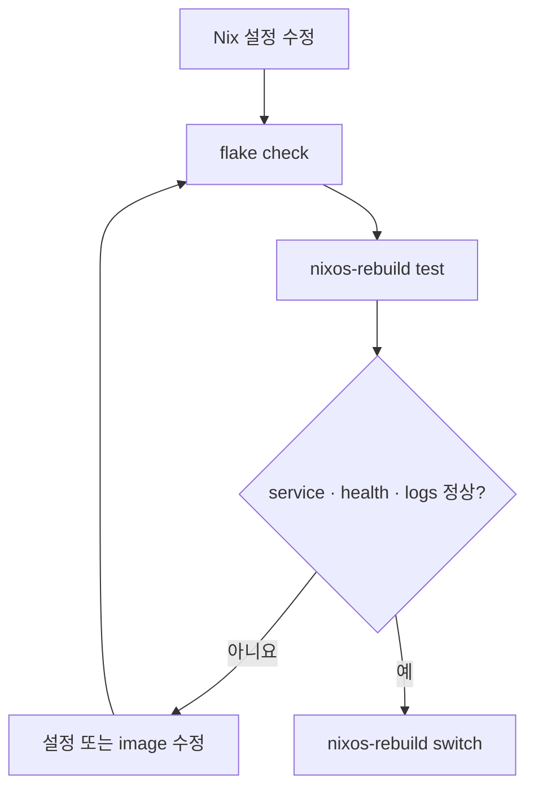
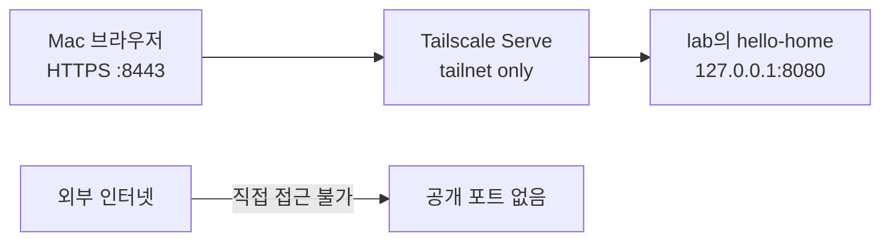

안녕하세요. 송기태입니다.

[이전 글](https://kitae0522.github.io/posts/2026-08-31-003/)에서 GitHub Actions runner 네 개를 병렬로 돌린 결과를 정리했습니다. 그런데 CI가 성공했다고 서비스가 홈서버에서 계속 실행되는 것은 아닙니다.

처음에는 저도 이렇게 생각했습니다.

> Actions에서 Docker build까지 끝났으면 lab에 container가 남아 있는 것 아닌가?

아닙니다. CI job을 위해 만든 container는 작업이 끝나면 사라집니다. 서비스로 계속 실행할 container는 별도로 배포해야 합니다.



이 글에서는 `hello-home`이라는 작은 웹앱을 예로 들어 전체 과정을 정리합니다. 실제 프로젝트에서는 이름, 포트와 데이터 경로만 바꾸면 됩니다.

## 1. 애플리케이션을 Docker image로 만든다

먼저 프로젝트 루트에 `Dockerfile`을 둡니다. Go 웹서버라면 다음처럼 multi-stage build를 사용할 수 있습니다.

```dockerfile
FROM golang:1.26-bookworm AS build
WORKDIR /src

COPY go.mod go.sum ./
RUN go mod download

COPY . .
RUN CGO_ENABLED=0 go build -trimpath -o /out/hello-home ./cmd/server

FROM gcr.io/distroless/static-debian12:nonroot
COPY --from=build /out/hello-home /hello-home
EXPOSE 8080
USER nonroot:nonroot
ENTRYPOINT ["/hello-home"]
```

서버에 올리기 전에 개발 컴퓨터에서 image가 만들어지는지 확인합니다.

```bash
docker build -t hello-home:dev .
docker run --rm -p 127.0.0.1:8080:8080 hello-home:dev
curl http://127.0.0.1:8080/health
```

여기서부터 실패한다면 홈서버 문제가 아닙니다. Docker image와 애플리케이션부터 고쳐야 합니다.

## 2. GitHub Actions가 image를 GHCR에 올린다

image를 매번 Mac에서 만들어 복사할 수도 있지만, 코드가 바뀔 때마다 GitHub Actions에서 검증하고 GHCR에 올리는 편이 반복하기 쉽습니다.

아래 job이 사용하는 `ci-ubuntu-docker`는 [별도 `ci-images` repository](https://github.com/kitae0522/ci-images)에서 만드는 공용 image입니다. Docker CLI, Buildx와 Compose만 포함하고 daemon은 넣지 않았습니다. 그래서 build job이 `lab`의 전용 socket을 명시적으로 받아야 합니다.



현재 runner에서 Docker build가 필요한 job은 일반 job과 다르게 전용 socket을 명시해야 합니다. 다음은 핵심만 줄인 예시입니다.

```yaml
name: Build image

on:
  push:
    tags: ['v*']

permissions:
  contents: read
  packages: write

jobs:
  image:
    runs-on: [self-hosted, lab, linux, x64, container, lab-small]
    timeout-minutes: 30
    container:
      image: ghcr.io/kitae0522/ci-ubuntu-docker:24.04
      env:
        DOCKER_HOST: unix:///run/lab-docker/docker.sock
      options: >-
        --cpus 1.5
        --memory 2560m
        --pids-limit 768
        --cgroup-parent docker-workloads-ci.slice
      volumes:
        - /run/lab-docker/docker.sock:/run/lab-docker/docker.sock

    steps:
      - uses: actions/checkout@v4

      - uses: docker/login-action@v3
        with:
          registry: ghcr.io
          username: ${{ github.actor }}
          password: ${{ secrets.GITHUB_TOKEN }}

      - uses: docker/build-push-action@v6
        with:
          context: .
          push: true
          tags: ghcr.io/kitae0522/hello-home:${{ github.ref_name }}
```

실제 repository에서는 action을 tag가 아니라 검토한 commit SHA로 고정하는 편이 공급망 변경을 통제하기 좋습니다. 위 코드는 흐름을 읽기 쉽게 줄인 예시입니다.

Docker socket을 받은 job은 host를 제어할 수 있는 강한 권한을 가집니다. 제가 관리하는 private repository의 신뢰된 branch와 tag에서만 실행해야 합니다. fork PR에는 이 workflow를 허용하지 않습니다.

## 3. GHCR image를 NixOS 서비스로 선언한다

GHCR에 image가 생겼다고 `lab`이 자동으로 실행하지는 않습니다. 계속 운영할 서비스는 Nix 설정에 선언합니다.

```nix
virtualisation.oci-containers.containers.hello-home = {
  image = "ghcr.io/kitae0522/hello-home:v0.1.0";
  autoStart = true;

  ports = [ "127.0.0.1:8080:8080" ];
  volumes = [ "/var/lib/hello-home:/data" ];

  extraOptions = [
    "--cpus=0.5"
    "--memory=256m"
    "--pids-limit=128"
    "--cgroup-parent=docker-workloads-services.slice"
  ];
};

# lab은 기본 Docker socket 대신 전용 socket을 사용한다.
systemd.services.docker-hello-home.environment.DOCKER_HOST =
  "unix:///run/lab-docker/docker.sock";
```

이 선언에는 중요한 결정이 다섯 개 들어 있습니다.

1. `latest`가 아니라 `v0.1.0`을 사용해 실행 버전을 알 수 있습니다.
2. 포트는 `127.0.0.1`에만 열어 인터넷이나 LAN에 바로 노출하지 않습니다.
3. `/var/lib/hello-home`에 데이터를 보존해 container를 다시 만들어도 데이터가 남습니다.
4. CPU, 메모리와 PID 상한을 둬서 하나의 앱이 서버 전체를 먹지 못하게 합니다.
5. 이 서버의 전용 Docker socket 경로를 systemd service에도 알려줍니다.

container가 root가 아닌 사용자로 실행된다면 `/var/lib/hello-home`의 소유자와 권한을 그 UID에 맞춰야 합니다. 앱마다 다르므로 image 문서를 확인하지 않고 `chmod 777`로 해결하지 않습니다.

private GHCR image라면 pull 인증도 별도로 준비해야 합니다. registry token을 Nix 파일이나 Git에 직접 적지 않고 root 전용 credential file로 전달해야 합니다. 첫 배포 예시는 인증 흐름을 단순하게 보기 위해 공개 image를 가정합니다.

## 4. 바로 영구 적용하지 않고 시험한다

설정을 수정한 뒤에는 평가, 임시 적용, 실제 확인, 영구 적용 순서로 진행합니다.

```bash
cd ~/.config/nix-darwin

nix flake check --all-systems --no-build
sudo nixos-rebuild test --flake .#lab

systemctl status docker-hello-home.service --no-pager -l
curl http://127.0.0.1:8080/health
docker ps --format 'table {{.Names}}\t{{.Status}}\t{{.Ports}}'

sudo nixos-rebuild switch --flake .#lab
```



`test`가 성공했다는 메시지만 보고 끝내지 않습니다. container가 active인지, health endpoint가 응답하는지, 필요한 데이터가 실제로 유지되는지 확인합니다.

로그는 다음처럼 봅니다.

```bash
journalctl -u docker-hello-home.service -f
```

## 5. 집 밖에서는 Tailscale Serve로 확인한다

서비스를 `127.0.0.1:8080`에 바인딩했기 때문에 외부에서는 직접 열리지 않습니다. [앞선 글](https://kitae0522.github.io/posts/2026-08-31-002/)에서 검증한 Tailscale Serve를 사용하면 터미널 없이 tailnet 전용 HTTPS 주소로 접근할 수 있습니다.

```bash
tailscale serve --bg --yes \
  --https=8443 \
  http://127.0.0.1:8080

tailscale serve status
```

기본 HTTPS 443번은 현재 Nginx 실험이 사용하고 있으므로 예제 앱에는 8443번을 사용했습니다. 실제 tailnet 이름을 가리면 접속 주소는 다음 형태입니다.

```text
https://lab.<tailnet>.ts.net:8443/
```



`--bg` 설정은 터미널을 닫거나 서버가 재부팅돼도 복구됩니다. 해당 앱의 Serve를 끌 때는 같은 HTTPS port를 지정합니다.

```bash
tailscale serve --https=8443 off
```

이 방식은 tailnet에 허용된 기기에게 앱을 공유합니다. Portainer처럼 Docker host의 강한 권한과 연결된 관리 도구는 여전히 SSH tunnel 뒤에 두는 편이 안전합니다.

다른 사람도 사용하는 공개 토이 프로젝트라면 이 단계가 달라집니다. 도메인, TLS, reverse proxy나 공개 tunnel, 인증과 rate limit을 먼저 설계해야 합니다. 지금의 `lab`은 인터넷 공개 경로를 제공하지 않고 Tailscale Funnel도 사용하지 않습니다.

## 새 버전은 어떻게 배포하나

새 코드로 `v0.2.0` image를 GHCR에 올렸다면 Nix의 image tag를 바꿉니다.

```diff
- image = "ghcr.io/kitae0522/hello-home:v0.1.0";
+ image = "ghcr.io/kitae0522/hello-home:v0.2.0";
```

그리고 다시 `check → test → runtime 확인 → switch`를 실행합니다. 문제가 생기면 이전 tag로 되돌리고 같은 절차를 반복합니다.

현재 구성에는 GHCR push 직후 production container를 자동 교체하는 CD가 없습니다. 의도적인 선택입니다. 작은 홈서버라도 새 image가 올라왔다는 이유만으로 자동 배포하기보다, health와 데이터 변경을 확인한 뒤 적용하고 싶었습니다.

나중에 반복이 귀찮아지면 다음 단계를 자동화할 수 있습니다.

- 새 image digest 감지
- Nix 설정의 version 업데이트 PR 생성
- 검증 통과 후 승인
- `lab`에서 test와 health check
- 성공할 때만 switch

처음부터 완전 자동화를 만드는 것보다 수동 절차를 한 번 끝까지 이해한 뒤 자동화하는 편이 안전합니다.

## 임시 실험과 상시 서비스는 구분한다

잠깐 테스트하는 앱은 `docker run --rm`이나 Docker Compose로 실행해도 됩니다. 하지만 재부팅 뒤에도 살아야 하고 데이터를 보존해야 하는 앱은 Nix에 옮깁니다.

| 용도 | 추천 방식 |
| --- | --- |
| 10분짜리 image 확인 | `docker run --rm` |
| 여러 container를 묶은 로컬 실험 | Docker Compose |
| 재부팅 뒤에도 유지할 홈서비스 | Nix `oci-containers` 선언 |
| 인터넷에 공개할 서비스 | Nix 선언 + 별도 공개·보안 설계 |

이 구분만 지켜도 몇 달 뒤 “이 container를 무슨 명령으로 띄웠지?”라는 상황을 크게 줄일 수 있습니다.

다음 글에서는 이 서버에 실제로 무엇을 올릴지 정리합니다. Vaultwarden, 저용량 NAS, 토이 프로젝트 중 지금 필요한 것과 아직 필요하지 않은 것을 구분하고, 유지보수와 백업 계획도 함께 적겠습니다.
