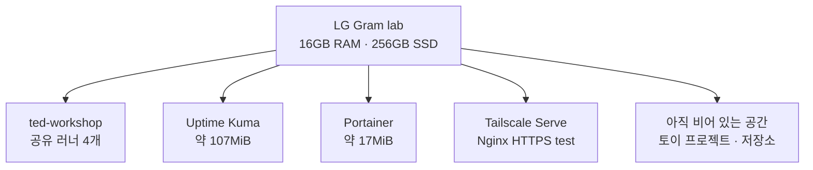
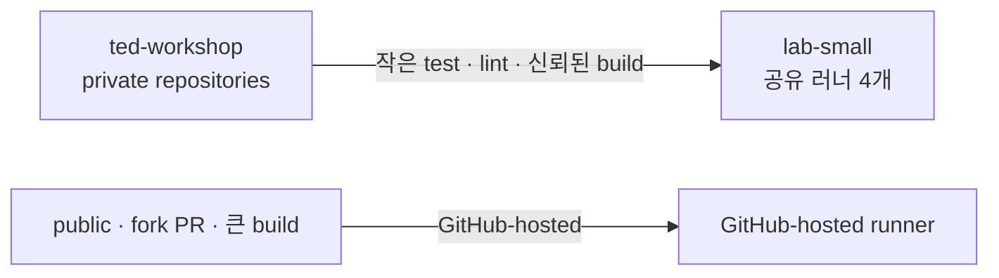
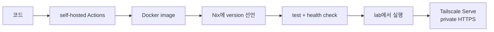
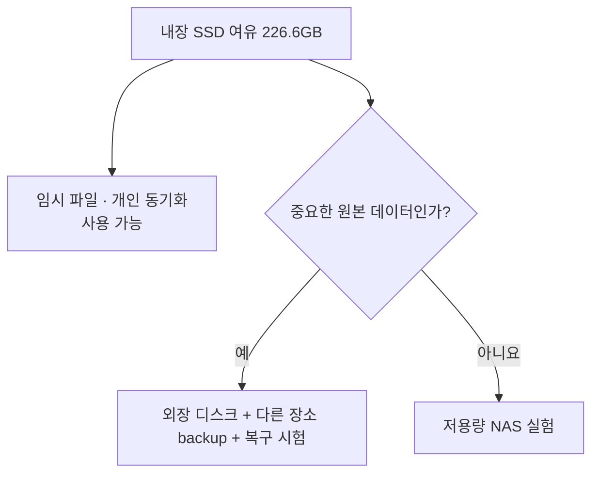
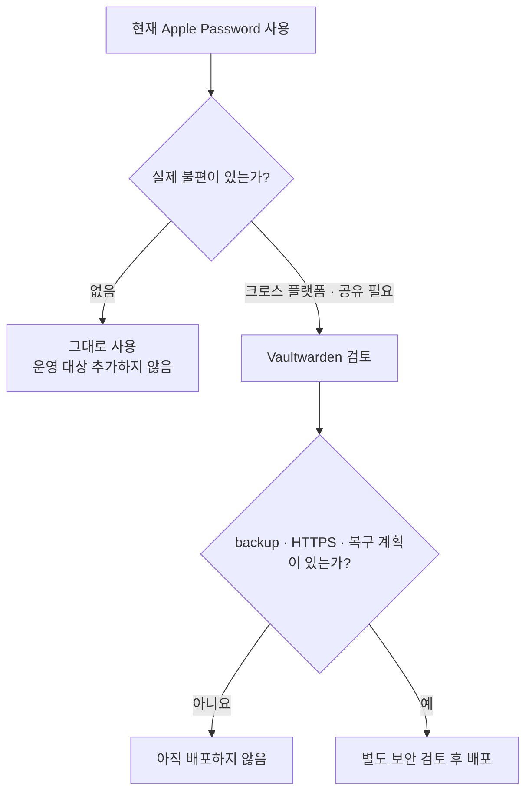
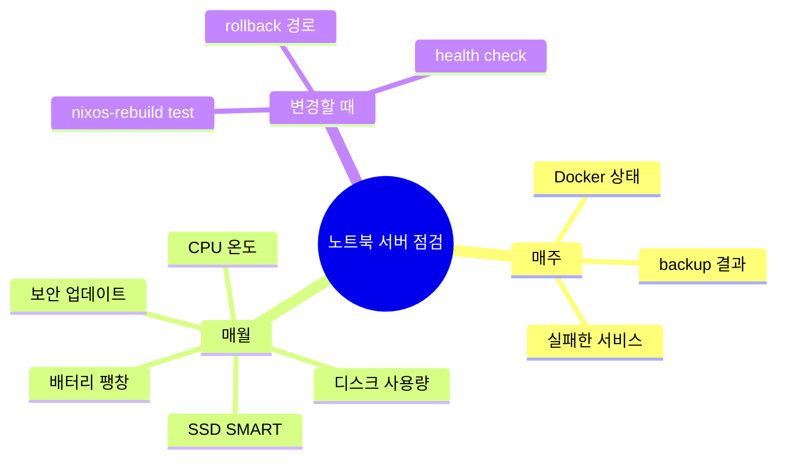

<nav class="series-toc" aria-label="홈서버 운영기 목차">
  <p class="series-toc__title">홈서버 운영기</p>
  <ol>
    <li><a href="/posts/2026-08-31-001/"><span>01</span> Actions 3,000분이 모자랐다</a></li>
    <li><a href="/posts/2026-08-31-002/"><span>02</span> 집 밖에서 접속하기</a></li>
    <li><a href="/posts/2026-08-31-003/"><span>03</span> 러너 4개 돌리기</a></li>
    <li><a href="/posts/2026-08-31-004/"><span>04</span> Docker 앱 올리기</a></li>
    <li><a href="/posts/2026-08-31-005/" aria-current="page"><span>05</span> 이제 무엇을 올릴까 <em>현재 글</em></a></li>
  </ol>
</nav>

안녕하세요. 송기태입니다.

GitHub Actions 시간이 부족해서 시작한 홈서버가 일단 동작하기 시작했습니다. [Docker 앱을 배포하는 절차](https://kitae0522.github.io/posts/2026-08-31-004/)도 정리했으니 이제 무엇을 올릴지 고를 차례입니다.

서버가 생기면 유명한 self-hosted 앱을 전부 설치하고 싶어집니다. 저도 Vaultwarden, NAS, AdGuard Home부터 떠올렸습니다. 하지만 서비스를 많이 올리는 것과 홈서버를 잘 쓰는 것은 다릅니다.

지금 필요한 것부터 하나씩 올리기로 했습니다.

## 현재 홈서버 스토리지 리소스 및 서비스 현황

2026년 8월 31일 현재 구성은 단순합니다.



| 항목 | 현재 값 |
| --- | ---: |
| root filesystem | 약 250GB |
| 사용 중 | 약 10.5GB, 5% |
| 사용 가능 | 약 226.6GB |
| Docker image | 약 2GB |
| 실패한 systemd unit | 0개 |
| active runner | 4개 |

SSD에는 공간이 많이 남아 있습니다. 그렇다고 바로 중요한 사진과 문서를 전부 옮길 생각은 없습니다. 남는 용량과 안전한 저장소는 같은 말이 아니기 때문입니다.

## 코어 워크로드: 프라이빗 CI 러너

이 서버를 만든 직접적인 이유입니다. private repository의 테스트, lint와 Docker image build를 처리합니다.

지금은 `ted-workshop` organization에 runner 네 개를 올려 두고, org 안의 private repository가 유휴 슬롯을 공유합니다. 새 저장소를 만들 때 runner를 추가하지는 않습니다. 동시에 네 개를 넘는 job은 queue에 남고, 더 많은 병렬이 필요하면 두 번째 서버를 추가해야 합니다.



모든 job을 무조건 집으로 보내는 것도 좋은 선택은 아닙니다. 무거운 빌드, 공개 fork PR, ARM이나 macOS가 필요한 job은 hosted runner가 더 적합합니다. `lab`은 제가 신뢰하는 작은 Linux container job을 많이 처리하는 역할에 집중시킬 생각입니다.

## 토이 프로젝트 배포용 샌드박스

제가 만든 작은 Go API, bot, webhook과 개인용 dashboard를 올리기에 좋습니다. 새 프로젝트를 배포할 때는 다음 흐름을 재사용합니다.



처음에는 저만 쓰도록 `127.0.0.1`에 바인딩하고 Tailscale Serve로 tailnet 전용 HTTPS 주소만 제공합니다. Portainer 같은 민감한 관리 도구는 SSH tunnel을 유지합니다. 다른 사람에게 공개해야 할 이유가 생겼을 때 도메인, 인터넷 공개 경로와 인증을 별도로 설계합니다. 토이 프로젝트라고 처음부터 인터넷 전체에 포트를 열 필요는 없습니다.

이 방식은 서비스를 빨리 많이 올리기보다, 한 번 만든 배포 절차를 반복하는 연습이기도 합니다.

## 저용량 단일 SSD 환경을 NAS로 쓸 때의 맹점

현재 약 226.6GB를 사용할 수 있으므로 작은 파일 교환 공간은 만들 수 있습니다. Tailscale 안에서만 SMB나 SFTP를 제공하면 집 밖에서도 제 기기끼리 파일을 주고받을 수 있습니다.

하지만 지금 상태를 NAS라고 믿고 중요한 원본을 맡기면 안 됩니다.

- SSD가 한 개뿐입니다.
- 디스크가 고장 나면 운영체제와 데이터가 함께 사라집니다.
- ECC 메모리가 없습니다.
- 256GB는 사진과 영상 archive로 금방 부족해집니다.
- 노트북과 같은 장소에 있는 backup은 화재나 도난에 취약합니다.



따라서 첫 NAS 용도는 없어져도 복구 가능한 파일로 제한합니다. 중요한 데이터를 넣기 전에는 외장 SSD나 HDD, 다른 장소의 backup과 실제 복원 시험을 먼저 준비할 계획입니다.

RAID도 backup은 아닙니다. 디스크 장애를 견디는 것과 실수로 지운 파일을 되찾는 것은 다른 문제입니다.

## Vaultwarden 도입을 보류한 실용적 이유

저는 이미 Apple Password 앱을 사용하고 있습니다. iPhone과 Mac 중심으로 생활하고 있고 지금 기능에 큰 불편이 없다면, Vaultwarden을 추가할 이유는 많지 않습니다.

Vaultwarden이 의미 있어지는 순간은 다음과 같습니다.

- Windows, Linux와 Android에서도 같은 경험이 필요할 때
- 가족이나 팀과 비밀번호 collection을 공유하고 싶을 때
- Bitwarden 생태계의 client와 기능이 필요할 때
- 데이터를 직접 관리하는 것이 운영 부담보다 중요할 때

반대로 Vaultwarden을 올리면 제가 책임질 것도 생깁니다.

- 암호화된 데이터와 attachment backup
- 업데이트와 취약점 대응
- HTTPS와 외부 접속 정책
- 서버 장애 중 비밀번호에 접근하는 방법
- 복구 key와 관리자 token 관리



결론은 “좋은 앱이니 일단 설치”가 아니라 “Apple Password로 해결되지 않는 문제가 생기면 설치”입니다. 비밀번호 관리 서비스는 다른 토이 프로젝트보다 실패 비용이 큽니다.

## 불필요한 인프라 관리 부담 최소화

AdGuard 구독 서비스를 이미 사용하고 있습니다. 홈서버에 AdGuard Home을 올리면 통제 범위는 늘지만, DNS 장애까지 제가 책임져야 합니다.

현재 구독 서비스에 불편이 없으므로 같은 문제를 다시 해결하지 않기로 했습니다. 홈서버의 빈 공간을 채우는 것이 목표는 아닙니다.

## 노트북 홈서버의 물리적 하드웨어 유지보수

노트북이라서 얻는 장점은 분명하지만, 같은 이유로 주기적으로 확인할 것도 있습니다.

### 배터리

내장 배터리는 순간 정전 때 작은 UPS가 됩니다. 반대로 계속 충전된 채 뜨거운 환경에 있으면 열화되거나 팽창할 수 있습니다. 외관, 충전 상태와 온도를 정기적으로 확인해야 합니다.

가능하다면 제조사가 제공하는 충전 상한 기능이나 BIOS 설정도 검토할 생각입니다. Nix 설정만으로 하드웨어의 모든 배터리 정책을 해결할 수 있는 것은 아닙니다.

### 발열과 먼지

작성 시점의 유휴 CPU 온도는 약 38℃였습니다. CI 중 온도와 throttling은 별도로 관찰해야 합니다. 통풍구를 막지 않고 먼지도 주기적으로 청소해야 합니다.

### 전원과 네트워크

노트북은 정전에도 잠시 살아 있지만 공유기와 모뎀은 꺼질 수 있습니다. 서버가 살아 있다는 것과 외부에서 접속할 수 있다는 것은 다릅니다.

USB Ethernet도 서버용 내장 NIC보다 빠지기 쉽습니다. 케이블과 어댑터를 움직이지 않게 두고, 문제가 생기면 내장 화면에서 interface와 NetworkManager 상태를 확인합니다.

### SSD와 백업

단일 SSD는 backup이 아닙니다. 사용량과 SMART 상태를 확인하고, 중요한 데이터는 다른 장치와 장소에도 보관해야 합니다.



## NixOS의 한계와 서비스 데이터 백업 전략

Nix 설정은 서버를 다시 만드는 방법을 보관합니다. Kuma의 monitor 목록, Portainer 데이터와 앞으로 생길 앱 데이터까지 보관해주지는 않습니다.

| 대상 | 현재 위치 | 필요한 backup |
| --- | --- | --- |
| Nix 설정 | Git repository | remote에 push |
| 로그인과 runner secrets | `/etc/nixos/secrets` | 암호화된 별도 backup |
| Uptime Kuma | `/var/lib/uptime-kuma` | 일관된 snapshot과 복원 시험 |
| Portainer | `/var/lib/portainer` | 일관된 snapshot과 복원 시험 |
| 앞으로의 앱 데이터 | `/var/lib/<service>` | 앱별 backup과 migration 절차 |

현재 가장 큰 미완성 항목은 자동 backup입니다. 설정은 복구할 수 있지만 서비스 데이터 backup은 아직 완성하지 않았습니다. 새로운 중요한 서비스를 추가하기 전에 먼저 해결해야 합니다.

## 인프라 설정 변경을 위한 표준 절차

미래의 제가 긴 문서를 읽기 싫을 때를 위해 명령도 짧게 남깁니다.

```bash
cd ~/.config/nix-darwin

nix flake check --all-systems --no-build
sudo nixos-rebuild test --flake .#lab

systemctl --failed --no-pager
docker ps --format 'table {{.Names}}\t{{.Status}}'

sudo nixos-rebuild switch --flake .#lab
```

빌드 성공과 실제 적용 성공은 다릅니다. `test`로 올리고 서비스, socket과 health를 확인한 뒤에만 `switch`합니다. 문제가 생기면 이전 NixOS generation으로 돌아갈 수 있습니다.

## 향후 홈서버 고도화 로드맵


가장 먼저 할 일은 멋진 새 서비스를 설치하는 것이 아니라 backup입니다. 그다음 작은 토이 프로젝트를 [앞 글의 Docker 배포 흐름](https://kitae0522.github.io/posts/2026-08-31-004/)으로 올려볼 생각입니다.

전력 효율이 정말 좋은지는 스마트 플러그로 측정해 월간 kWh와 비용을 기록해야 합니다. 현재는 저전력 노트북 CPU라는 특성과 38℃의 유휴 온도만 알고 있습니다. 숫자를 측정한 뒤 이 글도 업데이트할 계획입니다.

홈서버를 만들고 나니 설치할 수 있는 것은 아주 많았습니다. 하지만 지금 더 중요하게 느끼는 질문은 따로 있습니다.

> 이 서비스를 왜 집에서 직접 운영해야 하는가?

그 질문에 답할 수 있는 것만 하나씩 올리는 서버로 유지하려 합니다.
