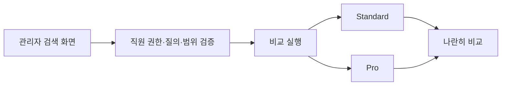
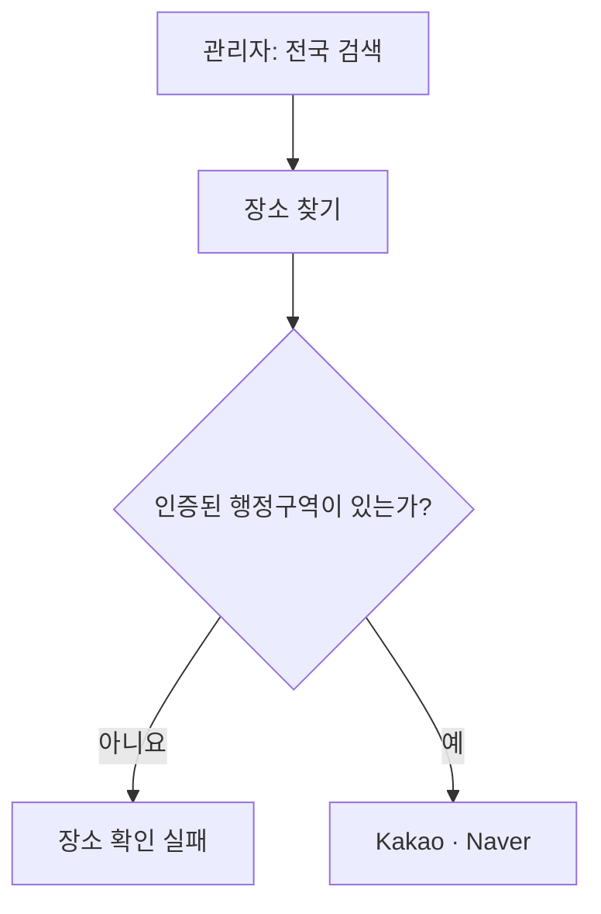

<nav class="series-toc" aria-label="맛집 검색의 Perplexity를 만들기로 했다 목차">
  <p class="series-toc__title">맛집 검색의 Perplexity를 만들기로 했다</p>
  <ol>
    <li><a href="/posts/2026-08-22-001/"><span>01</span> 검색엔진을 다시 설계하다</a></li>
    <li><a href="/posts/2026-09-05-001/" aria-current="page"><span>02</span> 실패를 볼 수 있는 검색엔진부터 만들었다 <em>현재 글</em></a></li>
    <li><a href="/posts/2026-09-05-002/"><span>03</span> LLM에게 검색 계획을 맡기지 않기로 했다</a></li>
    <li><a href="/posts/2026-09-05-003/"><span>04</span> 식당 후보와 근거 있는 식당은 다르다</a></li>
    <li><a href="/posts/2026-09-05-004/"><span>05</span> 답변을 쓰는 LLM을 믿지 않는 법</a></li>
  </ol>
</nav>

안녕하세요. 송기태입니다.

[첫 글](https://kitae0522.github.io/posts/2026-08-22-001/)에서 Palate의 검색엔진을 Standard와 Pro로 나누고, Pro를 **맛집 검색 도메인의 Perplexity**로 만들겠다고 적었습니다. 그 글의 마지막 문장은 꽤 조심스러웠습니다.

> 아직 검색엔진이 좋아졌다고 말할 단계는 아니다.

그 뒤로 Pro를 실제로 만들어 배포했습니다. 검색 한 건은 이런 순서로 흘러갑니다. 사용자 문장에서 조건을 뽑아내고, 자체 DB와 외부 검색에서 식당 후보를 모으고, 그 후보가 조건에 맞는다는 근거를 정리하고, 순위를 매기고, 출처가 달린 답변을 만듭니다.

그리고 관리자 화면에서 검색 버튼을 눌렀습니다. 실패했습니다. 고치고 다시 눌렀습니다. 또 실패했습니다.

모델을 바꾸거나 프롬프트를 길게 쓰기 전에 먼저 한 일은, **어디서 왜 실패했는지 볼 수 있게 만드는 일**이었습니다.

## 사용자 검색에는 아직 연결하지 않았다

Pro는 처음부터 일반 사용자 검색에 연결하지 않았습니다. 기존 공개 검색 API는 Standard 동작을 그대로 두고, 직원만 들어갈 수 있는 관리자 화면에서만 Pro를 돌렸습니다. 같은 질의와 같은 검색 범위를 두 엔진에 동시에 넣고 결과를 나란히 보는 구조입니다.



두 실행은 서로를 건드리지 않습니다. Pro가 시간 초과로 죽었다고 Standard까지 취소하지 않고, Standard가 먼저 끝났다고 Pro를 중단하지도 않습니다. 개인화 기억도 껐습니다. 취향이 섞이면 같은 질의에 대한 엔진 차이를 공정하게 비교할 수 없기 때문입니다.

이 경계 덕분에 아무리 실패해도 일반 사용자와의 약속은 그대로였습니다. 대신 관리자 화면에서는 실패가 아주 잘 보였습니다.

## 지도 API 호출 수가 0이었다

처음에는 지도 API가 느리거나 LLM 응답이 깨졌겠거니 생각했습니다. 실행 기록은 전혀 다른 이야기를 하고 있었습니다.

```text
자체 DB 후보    0건
임베딩 후보     0건
확인된 장소     0건
지도 API 호출   0회
실패한 곳       장소 확인 단계
```

지도 API 호출 수가 **0**이었습니다. Kakao나 Naver가 실패한 게 아니라, 호출하기도 전에 서버 내부 규칙이 요청을 걷어낸 것입니다.

관리자 비교의 기본 검색 범위는 `전국`이었는데, 장소를 찾는 로직 일부는 사용자의 인증된 행정구역이 정해져 있는 상태를 전제하고 있었습니다. 전국 검색을 넘겼지만 내부에서는 특정 시·구를 요구했고, 둘이 맞지 않아 외부 API까지 가지도 못했습니다.



이때 서버는 멀쩡히 떠 있었고, 헬스체크도 성공했고, CI도 초록불이었습니다. 그런데 검색은 실패했습니다.

여기서부터 네 가지를 분리해서 보기 시작했습니다.

| 확인 대상 | 알 수 있는 것 | 알 수 없는 것 |
| --- | --- | --- |
| CI 성공 | 소스와 자동화 테스트가 통과했는가 | 실제 외부 요청이 성공하는가 |
| 배포 | 의도한 코드가 서버에 올라갔는가 | 검색 한 건이 끝까지 완주하는가 |
| 헬스체크 | 프로세스와 필수 의존성이 준비됐는가 | Pro 결과가 유효한가 |
| 관리자 실검색 | 실제 환경에서 검색이 도는가 | 다른 질의도 안정적인가 |

초록불 하나로 나머지 셋을 대신할 수 없었습니다. 당연한 말 같지만, 그 전까지는 CI가 통과했으니 배포도 됐고 검색도 될 거라고 은근히 믿고 있었습니다.

## 어디서, 무엇이 실패했는지 나눠 적었다

`검색에 실패했습니다`만 보여주면 원인을 찾을 때마다 전체 흐름을 처음부터 다시 읽어야 합니다. 그래서 실패를 두 축으로 나눴습니다. **어느 경계에서 났는가**와 **어떤 종류인가**입니다.

```text
장소 확인 단계  /  장소를 검증하지 못함
근거 수집 단계  /  조건을 말할 근거가 부족함
답변 검증 단계  /  인용이 조건과 맞지 않음
```

둘을 곱셈으로 본 게 핵심이었습니다. 예를 들어 `시간 초과`는 특정 단계에 속한 오류가 아니라 어느 단계에서든 날 수 있습니다. 질의 해석에서 난 시간 초과와 외부 문서를 찾다가 난 시간 초과는 완전히 다른 문제고, 대응도 다릅니다. 실패를 목록이 아니라 좌표로 보기 시작하니 원인을 찾는 속도가 눈에 띄게 빨라졌습니다.

관리자 화면에는 후보를 어디서 몇 개 찾았는지, 지도 API를 실제로 몇 번 불렀는지, 외부 검색과 LLM을 몇 번 호출했는지, 단계별로 얼마나 걸렸는지도 함께 띄웠습니다. 결과는 세 상태로 구분했습니다. 조건을 근거와 함께 답한 `완료`, 일부만 답한 `부분`, 그리고 `실패`입니다.

대신 외부 응답 원문이나 사용자 질의 원문은 로그에 남기지 않았습니다. 디버깅 가능성과 개인정보 최소화는 둘 다 지켜야 하는 조건이라서, 내용 대신 개수와 사용량 같은 안전한 값만 남겼습니다.

## Kakao가 늦으면 Naver 차례가 오지 않았다

장소 확인은 Kakao를 먼저 부르고, 결과가 없거나 모호하면 Naver로 넘어갑니다. 그런데 Kakao 요청이 시간 초과로 끊기면 단계 전체가 그 자리에서 종료돼 Naver 차례가 오지 않았습니다.

여기서 구분해야 할 건 두 종류의 취소였습니다. Go에서는 요청 하나를 처리하는 동안 취소 신호가 컨텍스트라는 값을 타고 흐릅니다. 검색 전체에 걸린 컨텍스트가 있고, Kakao 호출 하나에만 걸어둔 짧은 제한 시간이 따로 있습니다.

```go
// 개념을 설명하려고 단순화한 코드입니다.
if errors.Is(err, context.DeadlineExceeded) && parentCtx.Err() == nil {
    // 검색 전체는 살아 있는데 Kakao 한 번의 제한 시간만 끝난 경우.
    // 빈 결과로 보고 Naver를 시도합니다.
    return nil, nil
}

// 검색 전체가 취소된 거라면 그대로 중단합니다.
return nil, err
```

외부 API 하나의 국소 시간 초과와 요청 전체의 취소를 같은 오류로 뭉개면 대체 경로가 사라집니다. 반대로 모든 시간 초과를 무시하면 이미 사용자가 떠난 요청이 계속 돌아갑니다. **검색 전체가 아직 살아 있는가**, 이게 경계였습니다.

## 고치면 그다음이 실패했다

검색 범위 문제를 고치자 장소 확인이 돌기 시작했습니다. 그랬더니 이번엔 근거를 정리하는 단계에서 실패했습니다. 그걸 고치니 인용 검증에서 실패했습니다. 또 다른 실행에서는 외부 조회 예산에서 막혔습니다.

솔직히 말하면, 고칠 때마다 새 문제가 튀어나오는 것 같아서 좀 지쳤습니다.

며칠 뒤에야 다르게 보였습니다. 새 문제가 생긴 게 아니라, 원래 있었지만 가려져 있던 다음 단계가 이제야 실행된 것이었습니다.


앞 단계가 항상 실패하면 뒤 단계의 버그는 아예 실행되지 않습니다. 첫 문제를 해결한 뒤 나타나는 다음 실패는 회귀일 수도 있지만, 꽤 자주 검색이 더 멀리 갔다는 증거이기도 합니다.

그래서 수정할 때마다 이 순서를 반복했습니다.

1. 지금 서버에 올라간 게 정말 내가 고친 코드인지 먼저 확인한다.
2. 응답에 찍힌 실패 좌표와 계측값을 본다.
3. 외부 호출 **전** 실패인지 **후** 실패인지 가른다.
4. 같은 조건을 항상 똑같이 재현하는 테스트 입력을 먼저 만든다.
5. 로컬 테스트, CI, 배포, 실제 관리자 검색을 각각 따로 검증한다.

이 과정에서 모델의 추론 강도 설정을 바꿔가며 실제 응답도 비교해 봤습니다. 다만 어떤 실행 하나가 성공했다고 바로 기본값을 바꾸지는 않았습니다. 외부 상황에 따라 흔들리는 문제와 구조 자체가 잘못된 문제는 분리해야 했으니까요.

## 출처를 붙이기 전에 필요했던 것

관리자 검색 화면은 사용자에게 보여줄 예쁜 UI가 아닙니다. 오히려 일부러 내부 상태를 잔뜩 드러냅니다.

사용자 화면에서는 `장소를 찾지 못했어요` 한 줄이면 충분한 상황도, 운영 화면에서는 아래 질문에 답할 수 있어야 합니다.

- 질의는 해석이 된 건가?
- 자체 DB에 후보가 없었던 건가?
- 지도 API를 못 부른 건가, 불렀는데 결과가 없었던 건가?
- 외부 출처가 없었던 건가, 있었는데 정책에서 거부된 건가?
- 근거가 부족한 건가, 답변이 근거를 잘못 인용한 건가?

Perplexity 같은 경험을 만들려면 검색 결과에 출처를 붙이면 된다고 생각하기 쉽습니다. 실제로 먼저 필요했던 건 출처 표시가 아니라, **검색이 어떤 결정을 거쳐 그 출처를 골랐는지 설명할 수 있는 내부 구조**였습니다.

## 품질보다 먼저 좋아진 것

Pro를 만들면서 가장 먼저 좋아진 건 추천 품질이 아니었습니다. 실패를 다음 사람도 똑같이 재현하고 분류할 수 있게 된 점이었습니다.

LLM을 쓰는 시스템은 오류 메시지마저 그럴듯해서 더 위험합니다. `모델이 이상한 답을 했다`고 뭉뚱그리는 순간, 검색 범위·시간 초과·예산·출처 소유권 같은 명백한 서버 문제가 전부 프롬프트 수정으로 흘러갑니다.

관측 가능성이 생기고 나서야 더 근본적인 문제가 보였습니다.

질의를 해석하는 LLM에게 자연어 이해뿐 아니라 문자열 위치 계산, 검색 범위 판정, 완성된 실행 계획까지 만들게 하고 있었습니다. 실패를 줄이려면 프롬프트를 더 정교하게 쓸 게 아니라, **LLM이 책임질 일을 줄여야 했습니다.**

[다음 글](https://kitae0522.github.io/posts/2026-09-05-002/)에서는 완성된 실행 계획을 LLM에게 맡기는 걸 그만둔 과정을 적겠습니다.
