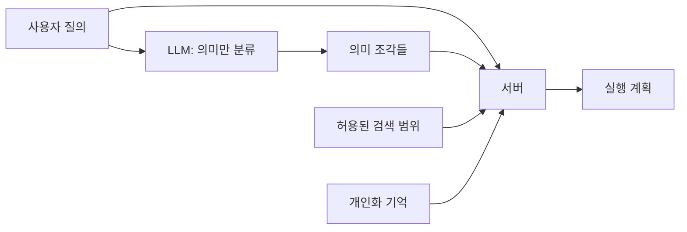
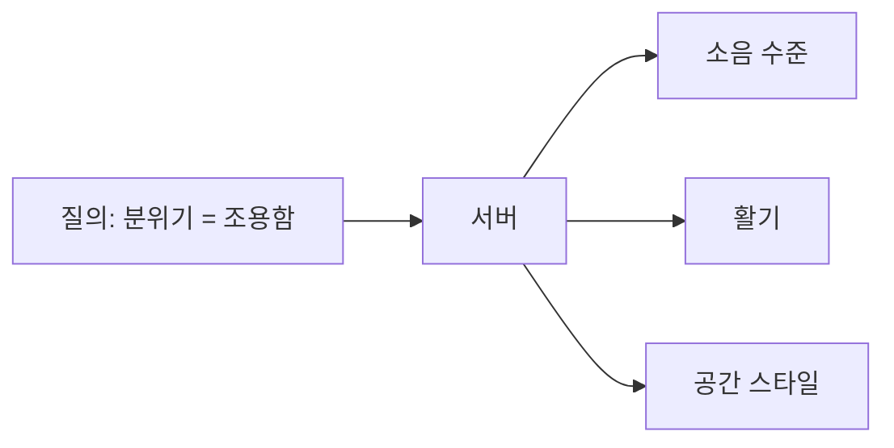
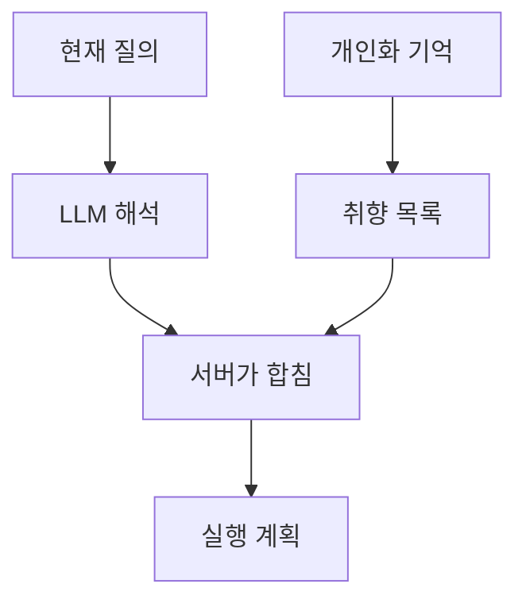

<nav class="series-toc" aria-label="맛집 검색의 Perplexity를 만들기로 했다 목차">
  <p class="series-toc__title">맛집 검색의 Perplexity를 만들기로 했다</p>
  <ol>
    <li><a href="/posts/2026-08-22-001/"><span>01</span> 검색엔진을 다시 설계하다</a></li>
    <li><a href="/posts/2026-09-05-001/"><span>02</span> 실패를 볼 수 있는 검색엔진부터 만들었다</a></li>
    <li><a href="/posts/2026-09-05-002/" aria-current="page"><span>03</span> LLM에게 검색 계획을 맡기지 않기로 했다 <em>현재 글</em></a></li>
    <li><a href="/posts/2026-09-05-003/"><span>04</span> 식당 후보와 근거 있는 식당은 다르다</a></li>
    <li><a href="/posts/2026-09-05-004/"><span>05</span> 답변을 쓰는 LLM을 믿지 않는 법</a></li>
  </ol>
</nav>

안녕하세요. 송기태입니다.

[이전 글](https://kitae0522.github.io/posts/2026-09-05-001/)에서는 Pro 검색이 어느 단계에서 실패했는지 볼 수 있게 만든 과정을 적었습니다.

진단이 가능해지자, 유독 자주 뜨는 실패가 하나 있었습니다. 사용자 문장을 해석하는 첫 단계에서 결과가 계약을 통과하지 못하는 실패였습니다.

처음엔 LLM이 JSON을 깨뜨린 줄 알았습니다. 로그를 열어 보니 대부분은 그게 아니었습니다. 의미상으로는 멀쩡한 응답인데 검사에서 떨어지고 있었습니다.

문제는 모델이 아니라, 우리가 그 LLM에게 시킨 일의 양이었습니다.

## `성수`와 `성수동` 때문에 검색이 죽었다

초기 구조에서는 LLM이 사용자 문장을 읽고 거의 완성된 **실행 계획**을 통째로 반환했습니다. 위치·메뉴·음식 종류·상황을 분류하고, 필수 조건과 선호 조건을 나누고, 각 표현이 원문의 몇 번째 글자에서 시작해 몇 번째에서 끝나는지 계산하고, 검색 범위와 위치가 충돌하는지 판단하고, 뒷단계에서 쓸 조건까지 만들었습니다.

서버는 그 결과를 엄격한 형식 검사로 걸렀습니다. 까다롭게 검사하니 안전하다고 생각했습니다.

그런데 사용자는 이렇게 검색합니다.

> 성수에서 조용한 돈까스집

서버가 관리하는 지역 이름 목록에 등록된 정식 명칭은 `성수동`일 수 있습니다. LLM이 원문 그대로 `성수`를 돌려주면 의미상 하나도 틀리지 않았는데도, 완성된 계획의 위치 값과 사용자에게 허용된 지역을 직접 대조하는 과정에서 불일치가 났습니다.

여기에 한글과 이모지가 섞인 문장의 글자 위치까지 모델이 정확히 세야 했습니다. 문장의 의미를 이해하는 일과 문자열의 몇 번째 글자인지 세는 일은 전혀 다른 문제인데, 우리는 그걸 한 응답에 묶어 놓고 있었습니다.

출력해야 할 값이 많아질수록, 정상적인 사용자 문장이 형식 위반으로 끝날 확률도 같이 올라갔습니다.

## LLM이 판단하는 값을 네 개로 줄였다

새 구조에서 LLM은 완성된 계획 대신 **의미 조각**만 반환합니다. 문장에서 조건 하나를 떼어낸 최소 단위라고 보면 됩니다.

```json
{
  "intents": [
    {
	    "sourceText": "성수",
	    "field": "location",
	    "normalizedValue": "성수",   
	    "strength": "required" 
	},
    { 
	    "sourceText": "조용한",
	    "field": "mood",    
	    "normalizedValue": "quiet",  
	    "strength": "preferred" 
	},
    { 
	    "sourceText": "돈까스", 
	    "field": "menu",     
	    "normalizedValue": "돈까스", 
	    "strength": "required" 
	}
  ]
}
```

조각 하나에서 LLM이 판단하는 값은 네 개뿐입니다.

| 필드                | 의미                       |
| ----------------- | ------------------------ |
| `sourceText`      | 사용자 원문에서 그대로 복사한 표현      |
| `field`           | 위치, 메뉴, 인원, 분위기 같은 의미 종류 |
| `normalizedValue` | 서버가 검사할 정규화된 값           |
| `strength`        | 필수인지, 선호인지, 피하고 싶은지      |

식당 ID, 출처, 인용, 순위, 필터, 검색 범위는 이제 LLM이 만들 수 없습니다. 개인화 기억도 보지 않습니다.



글자 위치는 서버가 계산합니다. LLM이 표현만 돌려주면, 서버가 원문에서 그 표현을 찾습니다. 이때 바이트가 아니라 사람이 세는 글자 단위로 셉니다. 한글 한 글자가 바이트로는 셋이라 기준을 잘못 잡으면 위치가 통째로 어긋나기 때문입니다.

서버는 유니코드 표기 차이를 추측해서 맞춰 주지 않고, 원문과 정확히 일치하지 않으면 그냥 거부합니다. 같은 표현이 여러 번 나오면 아직 다른 조건이 가져가지 않은 가장 왼쪽 것을 배정하고, 조각 순서가 뒤바뀌어 와도 항상 같은 결과가 나오도록 정렬합니다.

조금 보수적인 규칙입니다. 하지만 잘못된 위치를 조용히 고쳐 주는 것보다, 원문에 없는 표현을 거절하는 편이 출처를 지키기 쉬웠습니다.

## 사용자는 데시벨을 말하지 않는다

초기 조건 목록에는 `소음`이 있었습니다. 그런데 사용자는 검색할 때 데시벨을 말하지 않습니다.

조용한 곳, 아늑한 곳, 활기찬 곳, 힙한 분위기. 이 표현들은 사용자 입장에서 소음 수치가 아니라 **분위기**입니다. 그래서 질의 쪽 조건 이름을 분위기로 바꿨습니다.

다만 모든 상황 표현을 분위기에 몰아넣지는 않았습니다.

| 사용자 표현 | 조건 |
| --- | --- |
| 데이트하기 좋은 | 목적 = 데이트 |
| 혼자 밥 먹기 좋은 | 인원 = 혼자 |
| 조용하고 아늑한 | 분위기 = 조용함, 아늑함 |

왜 가는지, 누구와 가는지, 어떤 분위기를 원하는지는 서로 다른 질문입니다. 하나로 합치면 후보를 모으는 것도 평가하는 것도 흐려집니다.

재밌는 건 그 다음입니다. 사용자에게는 `분위기`로 받지만, 근거를 검증할 때는 다시 더 구체적인 차원으로 내려갑니다.



사용자의 언어와 내부 근거 모델이 같은 단어를 쓸 필요는 없었습니다. 오히려 억지로 맞추려 한 게 문제였습니다.

## 성동구 사용자가 해운대를 검색하면

LLM이 말하는 위치는 **검색 의도**입니다. 이 사용자가 어디를 검색해도 되는지 정하는 권한이 아닙니다.

```text
LLM이 읽은 위치        "성수"
서버가 허용한 범위      서울 성동구 (인증으로 잠김)
최종 후보의 실제 주소   서울 성동구
```

세 값의 역할을 갈랐습니다. LLM의 위치는 무엇을 찾고 싶은지 알려주고, 허용 범위는 후보가 절대 벗어날 수 없는 경계이고, 최종 후보의 실제 행정구역이 그 안에 있는지를 증명합니다.

그래서 위치를 해석하지 못했다고 해석 단계 전체를 실패시키지 않습니다. 반대로 명백히 다른 지역을 요청한 경우에는 외부 API 장애로 표시하지 않고, 사용자에게 지역을 다시 묻는 상태로 다룹니다.

성동구로 인증된 사용자가 `부산 해운대 맛집`을 검색했다면, Kakao API가 실패한 게 아닙니다. 검색 의도와 허용 범위가 충돌한 것이고, 사용자에게 되물어야 하는 상황입니다. 이걸 하나의 `검색 실패`로 뭉개고 있었다는 게 문제였습니다.

## 같은 `성수`도 쓰이는 곳이 다르다

의미 조각은 바로 검색에 쓰지 않습니다. 서버가 조각들을 받아 실행 계획으로 번역합니다.

같은 `성수`라도 쓰임이 다릅니다. 검색 범위를 강제하는 필터가 되기도 하고, 자체 DB를 뒤질 검색어가 되기도 하고, 나중에 근거로 확인해야 할 조건 목록에 오르기도 합니다. 조각 하나가 어디서 어떻게 쓰이는지가 이제 전부 코드에 적혀 있습니다.

덕분에 LLM이 조각 순서를 바꿔 보내도 결과가 흔들리지 않습니다. 서버가 항상 같은 방식으로 정렬한 뒤 계획을 만들기 때문입니다.

## 취향은 질의와 따로 읽는다

개인화 정보를 질의와 합쳐 LLM 프롬프트에 넣는 방법도 검토했습니다. 구현은 제일 간단합니다. 대신 책임이 섞입니다.

지금 말한 조건과 과거 취향의 출처가 흐려지고, 같은 질의도 프로필에 따라 해석이 달라지고, 기억이 필수 조건처럼 취급될 수 있고, 개인정보가 필요 이상으로 모델 제공자에게 넘어갑니다.

그래서 기억을 켠 경로에서는 질의 해석과 프로필 조회를 따로 돌리고, 둘 다 끝난 뒤 서버가 합칩니다.



우선순위는 고정했습니다.

```text
직접 말한 조건 > 직접 저장한 취향 > 행동으로 추정한 취향
```

직접 말한 조건이 항상 이깁니다. 추정한 취향은 비어 있는 조건만 채울 수 있고, 순위에는 첫 글에서 적었던 것과 같은 최대 `0.10`의 가산점까지만 줍니다.

기억이 절대 건드릴 수 없는 것도 못 박았습니다. 지역 잠금, 명시적 제외 조건, 알레르기·식이·건강 조건, 그리고 사용자가 지금 말한 예산이나 메뉴입니다.

프로필 조회가 실패해도 검색 전체를 실패시키지 않고 기억을 끈 상태로 계속합니다. 분위기는 그날 상황을 많이 타기 때문에, 한 번 검색했다고 장기 취향이 되지도 않습니다. 반복해서 확인되거나 사용자가 직접 저장했을 때만 후보가 됩니다.

## 엄격하게 검사할수록 더 자주 실패했다

처음에는 검사 규칙이 크고 자세할수록 결과가 안전해질 거라고 생각했습니다. 실제로는 반대였습니다. 모델이 책임질 기계적인 값이 늘어나고, 의미상 맞는 응답도 형식 검사에서 자꾸 떨어졌습니다.

의미 조각으로 바꾸고 나서 경계가 한 줄로 정리됐습니다.

> LLM은 사용자의 말을 해석한다. 서버는 그 해석으로 무엇을 할지 결정한다.

호출 횟수를 줄인 건 아닙니다. 검색 한 건에서 LLM은 여전히 세 번 일합니다. 질의를 해석하고, 찾아온 문서에서 사실을 골라내고, 답변에 쓸 근거를 고릅니다. 다만 범위 판정, 글자 위치, 기억 병합, 순위, 인용 조립은 전부 서버가 가져왔습니다. 모델을 덜 쓴 게 아니라, 의미 판단에 집중시키고 반복 가능해야 하는 규칙은 코드로 옮긴 것에 가깝습니다.

그런데 질의를 잘 해석한다고 추천이 곧바로 믿을 만해지는 건 아니었습니다. 후보가 어디서 왔는지, 그 후보를 추천할 근거가 있는지는 또 다른 문제였습니다.

[다음 글](https://kitae0522.github.io/posts/2026-09-05-003/)에서는 DB에 식당 행이 있다는 이유만으로 `Palate DB`라고 표시했던 문제를 적겠습니다.
