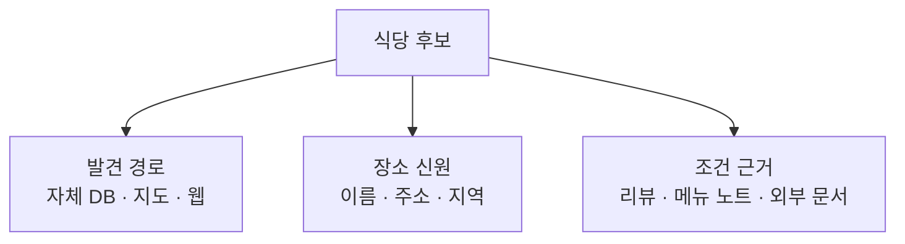
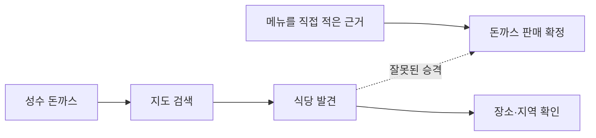
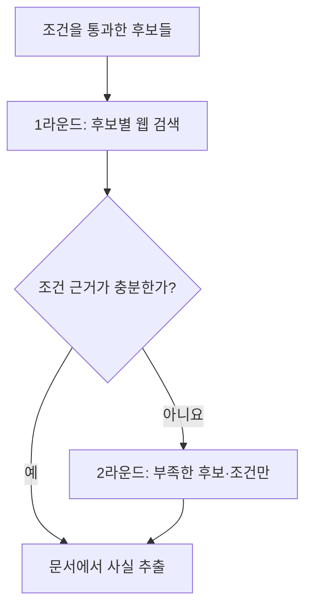
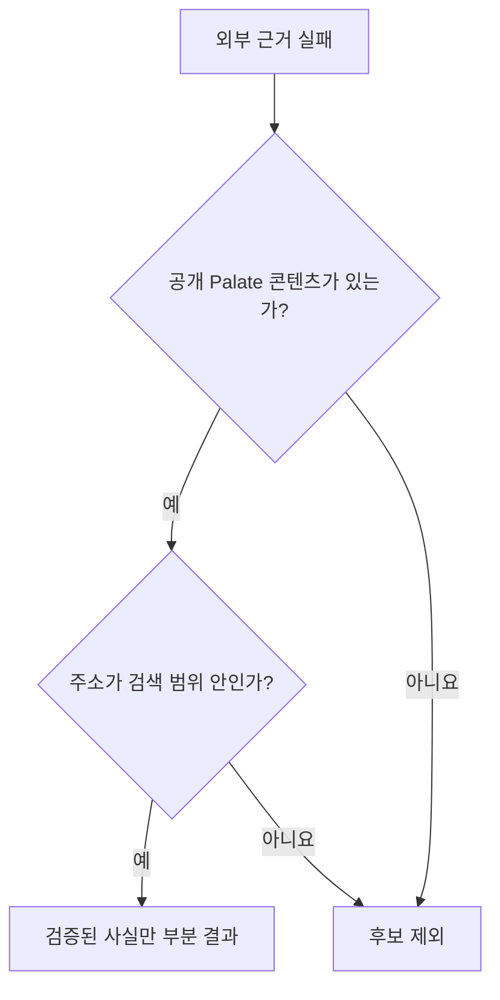

<nav class="series-toc" aria-label="맛집 검색의 Perplexity를 만들기로 했다 목차">
  <p class="series-toc__title">맛집 검색의 Perplexity를 만들기로 했다</p>
  <ol>
    <li><a href="/posts/2026-08-22-001/"><span>01</span> 검색엔진을 다시 설계하다</a></li>
    <li><a href="/posts/2026-09-05-001/"><span>02</span> 실패를 볼 수 있는 검색엔진부터 만들었다</a></li>
    <li><a href="/posts/2026-09-05-002/"><span>03</span> LLM에게 검색 계획을 맡기지 않기로 했다</a></li>
    <li><a href="/posts/2026-09-05-003/" aria-current="page"><span>04</span> 식당 후보와 근거 있는 식당은 다르다 <em>현재 글</em></a></li>
    <li><a href="/posts/2026-09-05-004/"><span>05</span> 답변을 쓰는 LLM을 믿지 않는 법</a></li>
  </ol>
</nav>

안녕하세요. 송기태입니다.

[이전 글](https://kitae0522.github.io/posts/2026-09-05-002/)에서는 LLM이 의미 조각만 반환하고, 실행 계획은 서버가 만들게 바꾼 구조를 설명했습니다.

그 변경을 배포한 뒤 관리자 화면에서 드디어 결과가 나오기 시작했습니다. `행운돈까스`, `오레노카츠 성수본점` 같은 식당이 후보로 떴고, 출처에는 `Palate DB` 배지가 붙어 있었습니다.

보다가 이상해서 이렇게 물었습니다.

> 아니 행운돈까스, 오레노카츠는 노트, 리뷰 하나도 없는데 어떻게 Palate DB야?

확인해 보니 식당 행은 정말로 DB에 있었습니다. 지도 검색에서 발견한 장소를 나중에 다시 찾으려고 저장해 둔 데이터였습니다. Palate 사용자가 쓴 리뷰나 메뉴 노트는 하나도 없었고요.

`Palate DB` 판정은 리뷰나 노트가 있는지를 보는 게 아니라, 식당 테이블에 그 식당 ID가 있는지만 보고 있었습니다. 식당을 **알고 있다**는 것과 그 식당을 **추천할 자체 근거가 있다**는 것을 같은 것으로 취급하고 있었던 겁니다.

## 식당 하나에 출처가 셋 있었다

처음에는 출처를 하나의 값으로 설명하려고 했습니다. 실제로는 최소 세 질문을 나눠야 했습니다.

1. 이 식당을 **어디서 발견**했는가?
2. 이 장소가 실재하고 그 지역에 있다는 건 **무엇으로 확인**했는가?
3. 사용자의 조건에 맞는다는 사실은 **어떤 콘텐츠가 뒷받침**하는가?



두 번째를 저는 **장소 신원**이라고 부르기로 했습니다. 그 이름과 주소의 가게가 실제로 그 자리에 있다는 것까지만 말해 주는 정보입니다.

지도 API로 식당을 찾아 DB에 저장했다면, 그건 1번과 2번에 대한 정보입니다. `혼밥하기 좋다`, `조용하다`, `웨이팅이 20분 이하다`라는 3번의 근거는 절대 되지 않습니다.

그래서 화면 표시와 내부 규칙을 분리했습니다.

| 구분 | 의미 | 조건 근거로 쓸 수 있나 |
| --- | --- | --- |
| Palate 콘텐츠 | 공개된 리뷰·메뉴 노트 등 자체 기록이 있음 | 해당 사실에 한해 가능 |
| 장소 정보 | Kakao·Naver로 이름·주소·업종을 확인 | 위치와 신원에만 |
| 외부 출처 | 이번 검색에서 찾은 웹 문서가 조건을 언급 | 언급 수준으로만 |
| 저장된 장소 | 지도 장소를 재사용하려고 DB에 저장 | **저장됐다는 사실만으로는 불가능** |

`DB에 행이 있다`는 건 출처의 종류가 아닙니다. 그냥 저장 상태일 뿐입니다.

## 검색어가 근거로 되돌아오고 있었다

Kakao 지도에서 `성수 돈까스`로 검색해 어떤 식당이 나왔다고 해 봅시다. 이 결과로 확인되는 건 생각보다 적습니다. 그 이름과 주소의 장소가 검색 결과에 존재하고, 업종이 음식점에 가깝고, 실제 행정구역이 검색 범위 안인지 검사할 수 있다는 것 정도입니다.

`돈까스`가 실제 판매 메뉴라는 사실은 여기서 나오지 않습니다. 검색어와 결과의 관계는 **후보를 발견한 신호**일 뿐입니다. 메뉴는 Palate의 공개 메뉴 기록, 식당 공식 정보, 또는 지금 찾은 외부 문서에 직접 적혀 있어야 사실이 됩니다.

이 구분을 하지 않으면 **질의가 근거가 되는 순환**이 생깁니다.



찾으려고 넣은 단어가 찾았다는 증거로 되돌아오는 구조인데, 검색어와 결과만 보면 꽤 그럴듯해 보여서 눈치채기 어렵습니다.

## 20초를 쓰고 세 조건이 `모름`으로 남았다

출처 경계를 엄격하게 만들자, 이번에는 근거 부족 실패가 쏟아졌습니다.

이건 후보가 없다는 뜻이 아닙니다. 후보는 있는데 사용자가 요청한 조건을 안전하게 말할 근거가 없다는 뜻입니다.

예를 들어 이런 질의를 봅시다.

> 성수에서 혼밥하기 좋고 조용한 돈까스집, 웨이팅 20분 이하

지도 API는 성수의 돈까스집을 여러 개 찾아 줍니다. 하지만 장소 신원만으로 혼밥·분위기·대기 시간을 알 수는 없습니다.

실제로 어떤 실행은 20.2초를 쓰고 외부 호출을 6번 하고도 이렇게 끝났습니다.

```text
행운돈까스
├─ 위치: 성동구        확인됨
├─ 메뉴: 돈까스        확인됨
├─ 인원: 혼자          모름
├─ 분위기: 조용함      모름
└─ 웨이팅: 20분 이하   모름
```

확인된 조건이 위치와 메뉴뿐이었습니다. 사용자가 물어본 다섯 개 중 셋이 `확인이 필요해요`인 겁니다.

조건이 `모름`인데도 추천하면 결과 수는 늘어납니다. 대신 사용자는 결국 다른 앱을 켜서 다시 확인해야 합니다. 첫 글에서 풀고 싶었던 바로 그 문제로 돌아가는 셈입니다.

## 검색어 하나에 조건을 다 넣고 있었다

원인을 찾다 보니 외부 검색 쪽에서 꽤 민망한 걸 발견했습니다. 후보마다 딱 한 번, 이런 검색어를 만들고 있었습니다.

```text
행운돈까스 돈까스 혼밥 조용한 2만원 이하 후기
```

식당 후기 한 문서에 이 표현이 전부 동시에 등장할 확률은 거의 없습니다. 식당은 실재하는데 외부 근거만 텅 비어 나오는 게 당연했습니다.

그래서 문서를 **찾는 일**과 조건을 **검증하는 일**을 갈랐습니다. 검색어도 한 문장으로 합치지 않고 갈래를 나눴습니다.

- 정확한 식당 이름과 지역으로 그 가게의 문서를 찾는 갈래
- 사용자가 요청한 메뉴·상황·분위기를 찾는 갈래
- 아직 `모름`인 조건만 콕 집어 보강하는 갈래

같은 이름의 다른 지역 식당 문서가 섞여 들어오거나, `조용한` 근거를 찾으려다 웨이팅 글만 계속 긁어 오는 걸 막기 위한 경계입니다.

## 후보마다 따로, 두 번에 나눠 찾았다

초기 외부 검색은 질의 전체에 한 번 돌리거나, 자체 DB 후보 하나를 기준으로 삼는 방식이었습니다. 지도에서 새로 발견된 후보는 웹 검색이 통째로 생략되기도 했습니다. 그래서 후보는 여러 개인데 보여줄 수 있는 출처는 지도 링크뿐인 결과가 나왔습니다.

이걸 후보별 수집으로 바꿨습니다.



물론 무제한으로 검색하지는 않습니다. 검색 한 건에서 외부 조회는 최대 세 번입니다. 먼저 두 후보의 근거를 찾고, 그래도 부족하면 남은 한 번을 가장 아쉬운 곳에 씁니다. 하루·한 달 예산과 시간 제한도 따로 걸어 뒀습니다.

## 한 후보가 실패해도 나머지는 남긴다

외부 검색은 네트워크와 사용량 제한, 시간 초과, 제공자 상태를 탑니다. 후보 셋 중 하나가 실패했다고 결과 전체를 버리면 검색이 너무 약해집니다.

그래서 회복 가능한 실패는 후보별로 가둡니다.

```text
후보 A: 웹 근거 확보
후보 B: 조회 시간 초과 → 지금까지 확보한 근거만 유지
후보 C: 예산 소진 → 외부 보강 중단
```

대신 제공자가 명시적으로 거부했거나 출처가 잘못 붙은 치명적 오류는 빈 결과처럼 숨기지 않습니다. 예산이 끝난 것과 근거가 없던 것과 정책에서 거부된 것은 운영상 완전히 다른 문제니까요. 관리자 화면에도 어느 제공자를 몇 번 불렀는지 그대로 표시했습니다. `외부`나 `DB` 한 단어로 뭉치면 다시 같은 함정에 빠집니다.

## 결과를 줄이더라도 출처는 틀리지 않게

외부 근거를 못 구해도, Palate 공개 콘텐츠가 있는 후보는 살아남을 수 있습니다. 이 경우 전부 실패시키는 대신 제한된 **부분 결과**를 반환합니다.

여기 들어갈 수 있는 조건은 보수적으로 잡았습니다. 실제 공개된 Palate 리뷰나 메뉴 노트가 있어야 하고, 최종 주소가 검색 범위 안이어야 하고, 함께 보여 주는 건 검증된 사실뿐입니다. 생성된 문장은 넣지 않습니다.

외부 검색에서만 발견된 후보는 근거 수집이 실패하면 부분 결과에도 넣지 않습니다. 신원을 다시 확인할 방법도, 공개할 조건 근거도 없기 때문입니다.



결과를 많이 보여 주는 것보다 잘못된 출처를 안 보여 주는 걸 우선한 정책입니다.

## 근거는 문서가 아니라 사실 단위로 쪼갠다

외부 문서 하나를 통째로 `좋은 근거`라고 표시하지 않습니다. 후보와 출처, 거기서 뽑아낸 개별 사실, 그리고 사용자 조건의 관계를 그물처럼 이어 둡니다.

```text
행운돈까스
├─ 출처 S1 (Palate 메뉴 노트)
│  └─ 메뉴 = 돈까스
├─ 출처 S2 (Kakao 장소 정보)
│  └─ 위치 = 성동구
└─ 출처 S3 (이번에 찾은 웹 문서)
   └─ 소음 수준 = 조용함
```

각 조건의 상태는 넷 중 하나가 됩니다.

| 상태 | 의미 | 답변에서 |
| --- | --- | --- |
| 확인됨 | 허용된 직접 근거로 확인 | 확인된 조건으로 표현 가능 |
| 언급됨 | 웹 문서에서 언급됨 | 외부 언급으로 표시, 재확인 안내 |
| 모름 | 판단할 근거 없음 | 확정 금지, 필수 조건이면 주 추천 제외 |
| 충돌 | 허용 근거끼리 어긋남 | 충돌 표시, 확정 금지 |

한 출처의 사실이 다른 후보로 넘어가거나, 출처는 있는데 그 조건을 뒷받침하는 사실이 없으면 그물 전체를 거부합니다.

## 기준을 낮추면 오류는 사라진다

근거 부족 실패를 없애는 가장 쉬운 방법은 기준을 낮추는 것입니다. `모름`인 조건도 그냥 추천하고 지도 검색 결과를 메뉴 근거로 승격하면 대부분 통과합니다.

그건 문제를 푼 게 아니라 오류 메시지를 끈 겁니다.

우리가 택한 건 이쪽이었습니다. 후보 발견과 콘텐츠 근거를 분리하고, 외부 근거를 후보별·조건별로 찾고, 예산 안에서 부족한 조건만 한 번 더 조회하고, 그래도 부족하면 자체 콘텐츠가 있는 후보만 부분 결과로 남기고, 외부에서만 발견된 후보는 근거가 실패하면 버립니다.

이제 관리자 화면에서 Palate 콘텐츠와 장소 정보와 외부 출처가 구분됩니다. DB에 행이 있다는 이유만으로 Palate가 검증한 식당처럼 보이는 일은 없어졌습니다.

그런데 근거가 정확해도, 마지막 LLM이 문장 한 줄을 과장해 버리면 사용자에게는 그냥 틀린 답입니다.

[다음 글](https://kitae0522.github.io/posts/2026-09-05-004/)에서는 답변을 쓰는 LLM에게서 문장 쓰는 권한을 뺏은 이유를 적겠습니다.
