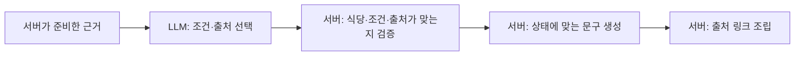
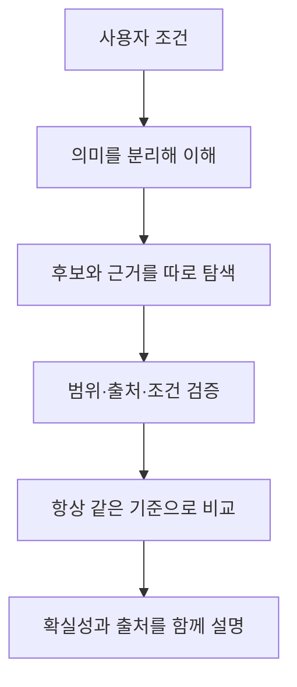

<nav class="series-toc" aria-label="맛집 검색의 Perplexity를 만들기로 했다 목차">
  <p class="series-toc__title">맛집 검색의 Perplexity를 만들기로 했다</p>
  <ol>
    <li><a href="/posts/2026-08-22-001/"><span>01</span> 검색엔진을 다시 설계하다</a></li>
    <li><a href="/posts/2026-09-05-001/"><span>02</span> 실패를 볼 수 있는 검색엔진부터 만들었다</a></li>
    <li><a href="/posts/2026-09-05-002/"><span>03</span> LLM에게 검색 계획을 맡기지 않기로 했다</a></li>
    <li><a href="/posts/2026-09-05-003/"><span>04</span> 식당 후보와 근거 있는 식당은 다르다</a></li>
    <li><a href="/posts/2026-09-05-004/" aria-current="page"><span>05</span> 답변을 쓰는 LLM을 믿지 않는 법 <em>현재 글</em></a></li>
  </ol>
</nav>

안녕하세요. 송기태입니다.

[이전 글](https://kitae0522.github.io/posts/2026-09-05-003/)에서는 식당을 어디서 발견했는지와 조건을 증명하는 근거를 분리하고, 사실 단위로 근거를 저장하게 만든 과정을 적었습니다.

이제 후보도 근거도 다 준비됐습니다. 남은 건 LLM이 그 근거를 읽고 자연스러운 추천 문장을 쓰는 일뿐입니다.

솔직히 여기가 제일 쉬운 단계라고 생각했습니다.

실제로는 마지막 문장 한 줄이 앞에서 쌓아 올린 신뢰를 통째로 무너뜨릴 수 있었습니다.

## 출처는 맞는데 문장이 틀렸다

이런 근거가 있다고 해 봅시다.

```text
조건    분위기 = 조용함
상태    언급됨
사실    조용하게 식사했다는 공개 언급이 있어요.
출처    S3
```

LLM은 이 근거로 이런 문장을 만들 수 있습니다.

> 항상 조용해서 데이트하기에 완벽한 식당이에요. [S3]

출처는 멀쩡히 붙어 있습니다. 그런데 세 가지가 달라졌습니다. `언급됨`이 확정 사실이 됐고, 한 번의 언급이 `항상`으로 부풀었고, 근거에 없던 `데이트하기에 완벽하다`가 새로 생겼습니다.

출처가 실재하는지만 검사해서는 이걸 하나도 못 막습니다. 그 출처가 **이 식당의 이 조건을 실제로 지지하는지**, 그리고 확신의 세기를 올려 말하지 않았는지까지 봐야 합니다.

## 처음에는 LLM 문장을 검사하려고 했다

초기 구조에서 LLM은 문장과 출처를 함께 반환했습니다.

```json
{
  "text": "돈까스가 맛있고 조용해서 혼밥하기 좋아요.",
  "sourceIds": ["S1", "S3"]
}
```

서버는 문장 속 숫자가 출처에 있는지, 링크나 내부 ID가 새어 나왔는지, 출처와 식당이 일치하는지 검사했습니다. 실패하면 한 번만 고쳐 달라고 요청하고, 그래도 안 되면 안전한 후보만 남겼습니다.

문제는 자유 문장을 완전히 검증하는 게 사실상 불가능하다는 것이었습니다. `맛있다`, `좋다`, `완벽하다` 같은 평가 표현은 숫자 대조로 판정할 수 없습니다. 한국어 문장을 다시 의미 분석하려면 또 다른 LLM 검증기가 필요하고, 그러면 그 검증기의 판단을 또 믿어야 합니다. 믿을 수 없는 걸 검사하려고 믿을 수 없는 걸 하나 더 붙이는 셈이었습니다.

그래서 질문을 바꿨습니다.

> LLM이 꼭 최종 문장을 써야 하나?

## 문장 쓰는 권한을 뺏었다

지금 LLM은 어떤 조건과 출처를 답변에 쓸지만 고릅니다.

```json
{
  "conditionId": "분위기:조용함",
  "sourceIds": ["S1", "S3"]
}
```

문장이 사라졌습니다. 형식에서 아예 허용하지 않습니다. LLM은 후보 순서를 바꿀 수도, 새로운 사실이나 숫자를 만들 수도 없습니다. 서버가 건네준 근거 안에서 조건과 출처의 조합을 고를 뿐입니다.



그래도 LLM은 여전히 필요합니다. 여러 후보와 근거 중에서 이 사용자에게 뭐가 중요한지 고르는 건 자연어 이해가 있어야 하는 일입니다. 다만 **고를 수 있는 재료**와 **최종 표현의 권한**을 갈랐습니다.

## 같은 근거는 항상 같은 문장이 된다

검증을 통과한 선택을 서버가 문장으로 바꿉니다. 문구는 조건 상태별로 고정돼 있습니다.

`확인됨`이라면 이렇게 나갑니다.

> 분위기 조건을 확인했어요. 조용한 편이에요.

`언급됨`이라면 확신을 한 단계 낮춥니다.

> 공개 근거에서 분위기 관련 언급을 찾았어요. 방문 전에 실제 분위기 정보를 확인해 주세요.

`모름`과 `충돌`은 아예 추천 문장이 될 수 없습니다. 대신 `모름`인 조건은 따로 모아서, 사용자가 뭘 아직 확인해야 하는지 보여 줍니다.

| 상태 | LLM이 고를 수 있나 | 서버 표현 |
| --- | --- | --- |
| 확인됨 | 가능 | 확인된 조건으로 표현 |
| 언급됨 | 가능 | 외부 언급 + 재확인 안내 |
| 모름 | 불가 | 미확인 조건으로 별도 표시 |
| 충돌 | 불가 | 충돌 상태로 별도 표시 |

이 방식의 문장은 확실히 심심합니다. 대신 같은 사실과 같은 상태는 항상 같은 문장이 됩니다. 모델을 바꾸든 제공자를 바꾸든 `언급됨`이 어느 날 갑자기 단정형으로 변하지 않습니다.

문장 품질을 조금 포기하고 예측 가능성을 샀다고 보는 게 정확합니다. 지금 단계에서는 그게 맞는 거래라고 생각했습니다.

## 주차 후기를 분위기 근거로 쓸 수는 없다

서버는 고른 출처가 정말 이 식당의 이 조건을 뒷받침하는지 다시 확인합니다. 링크가 아무리 멀쩡해도 조건이 다르면 그건 출처가 아닙니다.

다른 식당의 좋은 리뷰를 끌어다 붙이는 것, 같은 식당의 주차 관련 글을 분위기 주장에 다는 것, 같은 문서를 두 번 세는 것, LLM이 후보 순서를 슬쩍 바꾸는 것. 전부 여기서 걸립니다.

## `언급됨`을 왜 남겨 뒀나

모든 외부 근거를 `확인됨`으로 올리지는 않습니다. 웹의 짧은 문맥이나 공개 게시물 하나는 유용하지만, 그게 최신이고 대표적인 사실이라는 보장은 없습니다.

그렇다고 전부 버리면, Palate 자체 데이터가 아직 적은 초기 제품은 답할 수 있는 게 너무 없어집니다.

`언급됨`은 그 사이에 있는 제품 언어입니다. 무언가를 찾긴 했고, Palate가 확정한 사실은 아니고, 결정하기 전에 다시 확인할 가치가 있다는 뜻입니다.

Perplexity 같은 경험에서 중요한 건 모든 문장을 자신 있게 말하는 게 아니라, **출처와 확실성의 차이를 사용자가 알아볼 수 있게 보여 주는 것**이라고 생각합니다.

## 출처는 링크가 아니라 사이트 단위로 센다

Kakao 장소 링크 네 개가 있다고 독립 출처 네 개로 세면 안 됩니다. 다양성은 링크 개수가 아니라 **어느 사이트에서 왔는지**로 계산합니다.

```text
Kakao 장소 링크 + Naver 블로그 링크   → 서로 다른 두 곳
Kakao 장소 링크 2개                   → 한 곳
같은 블로그의 글 여러 개              → 한 곳
```

완전한 결과로 인정받으려면 서로 다른 두 곳 이상이 필요하고, 그중 최소 하나는 지도가 아니어야 합니다. 지도가 알려주는 것과 후기가 알려주는 것이 애초에 다르기 때문입니다. 출처 수를 부풀리려는 중복 인용은 품질이 아닙니다.

## 마지막 CI 실패는 import 두 줄이었다

답변 신뢰 경계를 강화한 PR에서, 백엔드와 웹 테스트를 다 통과시켜 놓고 CI의 포맷 검사에서 떨어졌습니다. 원인은 관리자 화면 파일의 import 순서가 코드 스타일 규칙과 안 맞는 것이었습니다.

제품 로직과 아무 상관 없는 두 줄이었지만, CI가 실패한 건 맞습니다. 제 로컬 검증 목록에 포맷 검사 명령이 빠져 있었습니다. import를 정렬하고 같은 명령과 타입 검사, 관련 화면 테스트를 다시 돌렸습니다.

이 일도 검색에서 배운 것과 똑같았습니다.

> 복잡한 검증을 많이 통과했다고 마지막 작은 경계를 건너뛰어도 되는 건 아니다.

질의 해석과 근거 검증과 출처 검증이 다 안전해도, 화면에 내보내는 곳 한 군데에서 출처 이름을 잘못 붙이면 사용자는 잘못 이해합니다. 백엔드 테스트가 전부 초록불이어도 포맷 검사를 안 돌렸으면 그 PR은 끝난 게 아닙니다.

## 그래서 지금 Perplexity처럼 됐나

아닙니다. 아직은요.

가장 큰 이유는 Pro가 아직 일반 사용자가 쓰는 검색이 아니기 때문입니다. 지금까지 한 건 관리자 화면에서 Pro를 실제로 돌려 보고 신뢰 경계를 검증한 것까지입니다. 세션, 재검색, 사용량 제한, 검색 기록, 결과 화면에 이 구조를 안전하게 잇는 일이 통째로 남아 있습니다.

구조가 좋아진 것과 사용자가 더 좋은 결정을 내리는 것도 다른 얘기입니다. 결국 물어야 할 건 이겁니다. 상위 세 개 안에서 실제로 고를 수 있는가, 조건마다 근거가 붙어 있는가, 출처가 정확한가, 필수 조건을 어긴 식당이 섞여 있지 않은가, 그리고 기다릴 만한 속도인가. 처음 정한 평가 세트로 이걸 계속 재야 합니다.

## 지금은 조금 다르게 본다

처음에는 실시간 웹 검색을 하고 LLM이 출처와 함께 답하면 Perplexity와 비슷해질 거라고 생각했습니다.

지금 생각은 이렇습니다.



맛집 검색에서 필요한 건 웹 문서를 잘 요약하는 능력만이 아닙니다. 장소 신원, 행정구역, 메뉴, 가격, 분위기, 그리고 시간이 지나면 변하는 정보를 각각 다른 확실성으로 다뤄야 합니다. 사용자가 지금 말한 조건과 과거 취향도 섞이면 안 됩니다.

무엇보다, 모르는 건 모른다고 말해야 합니다.

이번 작업에서 LLM을 부르는 횟수는 검색 한 건에 세 번 그대로입니다. 하지만 시스템 안에서 LLM이 가진 권한은 처음보다 훨씬 작아졌습니다. 자연어 의미 판단과 중요한 근거 선택에는 모델을 쓰고, 위치·범위·순위·문장·출처의 최종 권한은 서버가 가집니다.

검색엔진을 더 똑똑하게 만들려고 시작했는데, 실제로 한 일의 대부분은 **무엇을 믿지 않을지 정하는 일**이었습니다.

그 경계가 생긴 지금부터가, 품질을 측정하고 사용자에게 연결하는 시작이라고 생각합니다.
