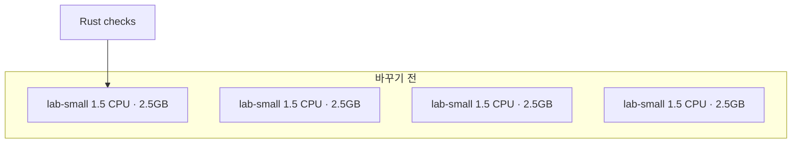
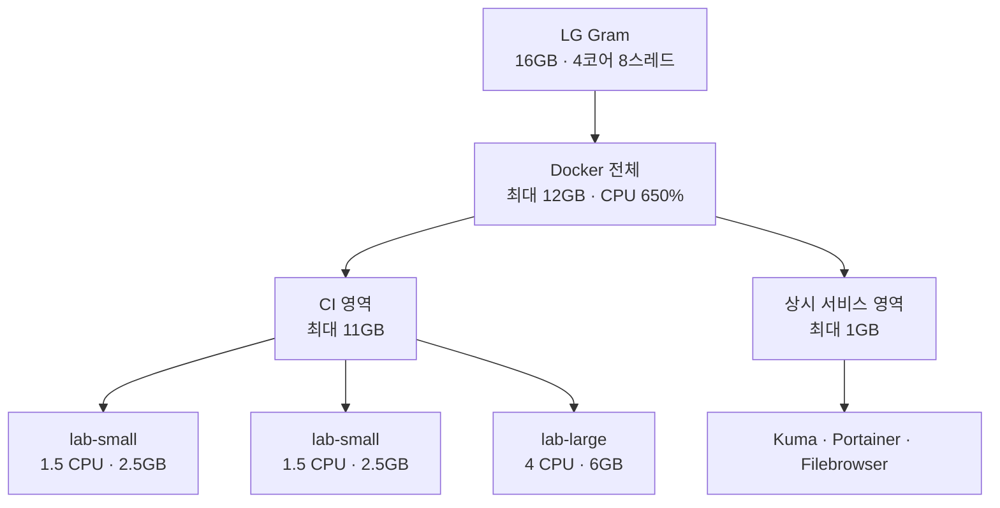
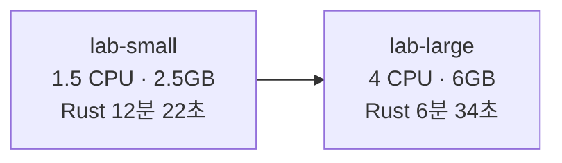

<nav class="series-toc" aria-label="홈서버 운영기 목차">
  
홈서버 운영기

  <ol>
    <li><a href="/posts/2026-08-31-001/">01 Actions 3,000분이 모자랐다</a></li>
    <li><a href="/posts/2026-08-31-002/">02 집 밖에서 접속하기</a></li>
    <li><a href="/posts/2026-08-31-003/">03 러너 4개 돌리기</a></li>
    <li><a href="/posts/2026-08-31-004/">04 Docker 앱 올리기</a></li>
    <li><a href="/posts/2026-08-31-005/">05 이제 무엇을 올릴까</a></li>
    <li><a href="/posts/2026-09-17-001/" aria-current="page">06 러너 2+1로 나누기 <em>현재 글</em></a></li>
  </ol>
</nav>

안녕하세요. 송기태입니다.

[러너 네 개를 병렬로 돌린 글](https://kitae0522.github.io/posts/2026-08-31-003/)을 쓸 때는, 슬롯이 많으면 작은 job이 줄을 서지 않는 것이 장점이었습니다. 그 판단은 작은 Go test에는 맞았습니다. Rust workspace CI에는 맞지 않았습니다.

같은 노트북에서 호스트 CPU와 RAM은 그대로 두고, job 상자의 한도만 바꿨습니다. 한 private 저장소의 CI가 **15분 2초에서 8분 3초**로 줄었습니다. 거의 전부가 Rust checks였습니다.

## 네 개의 같은 상자가 rust를 느리게 만든 이유

이 저장소의 CI는 네 job입니다. `Rust checks`, `Web checks`, `Repository contracts`가 같이 시작하고, 셋이 끝난 뒤에 `Integrated runtime gate`가 돕니다.

바꾸기 전 main push 한 번의 실측입니다.

| job | 시작 | 완료 | 소요 시간 |
| --- | --- | --- | ---: |
| Repository contracts | 15:35:34 | 15:36:08 | 34초 |
| Web checks | 15:35:34 | 15:37:11 | 1분 37초 |
| Rust checks | 15:35:34 | 15:47:56 | 12분 22초 |
| Integrated runtime gate | 15:48:59 | 15:50:32 | 1분 33초 |
| **전체** | 15:35:31 | 15:50:33 | **15분 2초** |

web과 repository는 rust가 clippy를 시작하기 전에 이미 끝났습니다. 네 러너가 서로 CPU를 빼앗아서 느린 것이 아니었습니다. rust 상자 자체가 `--cpus 1.5 --memory 2560m`으로 묶여 있었습니다.

러너 프로세스 네 개는 GitHub이 job을 네 개까지 스케줄할 수 있다는 뜻이지, rustc에 코어 네 개를 준다는 뜻이 아닙니다. 실제 한도는 job `container.options`입니다. 슬롯을 합쳐도 그 숫자가 그대로면 컴파일 시간은 그대로입니다.

네 칸 중 세 칸이 비어 있어도 rust는 1.5 CPU입니다.

## 짧은 잡 둘, 큰 잡 하나

호스트는 그대로 LG Gram i5-8250U, 물리 코어 4개, 메모리 약 16GB입니다. Docker CI slice 한도도 그대로 최대 11GB입니다. 바꾼 것은 슬롯 구성과 큰 잡의 상자입니다.

| 슬롯 | 개수 | 라벨 | 상자 |
| --- | ---: | --- | --- |
| 짧은 잡 | 2 | `lab-small` | 1.5 CPU · 2,560MB · PID 768 |
| 큰 잡 | 1 | `lab-large` | 4 CPU · 6,144MB · PID 1,536 |

워크플로에서는 rust와 이미지 빌드가 있는 integrated runtime만 `lab-large`로 보냅니다. web과 repository 계약은 이전과 같은 `lab-small`입니다. large는 한 자리뿐이라, 두 개의 rust가 동시에 1.5 CPU씩 나눠 갖는 일은 없습니다.

small 한도를 올리지 않은 이유는 [이전 글](https://kitae0522.github.io/posts/2026-08-31-003/)과 같습니다. SSH가 살아 있으려면 CI가 호스트를 가득 채우면 안 됩니다. 큰 잡 하나가 6GB를 쓰고 small 둘이 잠깐 겹쳐도 CI slice 11GB를 넘기지 않게 6GB에서 멈췄습니다. 실측상 web과 repository는 rust clippy 전에 끝나므로, 컴파일 구간에서는 large가 상자를 거의 혼자 씁니다.

## 같은 노트북, 같은 단계, 다른 상자

워크플로 단계, 테스트, sccache, ffmpeg apt 설치는 그대로 두었습니다. 바뀐 것은 runner 라벨과 `--cpus` / `--memory` / `--pids-limit`입니다.

바꾼 뒤 같은 저장소 main push의 실측입니다.

| job | 시작 | 완료 | 소요 시간 |
| --- | --- | --- | ---: |
| Repository contracts | 16:52:50 | 16:53:27 | 37초 |
| Web checks | 16:52:50 | 16:54:33 | 1분 43초 |
| Rust checks | 16:52:50 | 16:59:24 | 6분 34초 |
| Integrated runtime gate | 16:59:27 | 17:00:49 | 1분 22초 |
| **전체** | 16:52:47 | 17:00:50 | **8분 3초** |

| | 바꾸기 전 | 바꾼 뒤 |
| --- | ---: | ---: |
| 전체 | 15분 2초 | 8분 3초 |
| Rust checks | 12분 22초 | 6분 34초 |
| Web checks | 1분 37초 | 1분 43초 |
| Repository contracts | 34초 | 37초 |
| Integrated runtime gate | 1분 33초 | 1분 22초 |

web과 runtime은 거의 그대로입니다. 벽시계가 줄어든 이유는 rustc와 clippy가 1.5 CPU 대신 4 CPU를 쓰기 시작했기 때문입니다. 노트북을 바꾸거나 테스트 일부를 뺀 것이 아닙니다.

## 아직 그대로인 것

ffmpeg는 매 런 `apt-get`으로 설치합니다. sccache restore도 그대로입니다. 이번 변경의 목적은 그 비용을 지우는 것이 아니라, 컴파일이 상자 한도에 막히지 않게 하는 것이었습니다.

large 슬롯은 하나입니다. 한 CI 안에서는 rust가 끝난 뒤에 runtime이 같은 자리를 쓰므로 충돌하지 않습니다. 다른 저장소가 동시에 large를 요청하면 기다립니다. 짧은 잡은 small 두 개로 충분합니다.

예전 `lab-small`만 가리키던 워크플로는 호스트에 small이 두 개만 남습니다. 라벨을 바꾸기 전에 슬롯만 줄이면, 무거운 잡이 짧은 잡과 두 자리를 두고 줄을 섭니다. 호스트 구성과 워크플로 라벨은 같이 바꿔야 합니다.

다음으로 손볼 후보는 ffmpeg를 CI image에 넣는 일입니다. 지금은 매 런 1분 가까이 반복됩니다. 상자 크기를 바꾸는 일과는 별개입니다.
